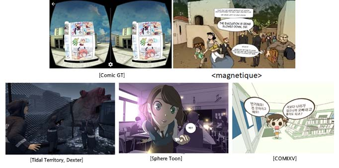

## 2.1.  Suitable VR comics genre for the VR market

- **Comics with potential IP growth and overwhelming productivity. It is suitable for VR platforms lacking content and struggling with continuous user inflow.** 
- Still images and story centered contents make it possible to run in low-spec  independent VR devices.
- Low production cost due to single artist creative system.
- Effective IP utilization with popular author and characters.
- Various genres for potential readers.
- Securely maintain continuous user inflow and high retention rate through webtoon series.

- **The initial role of Naver (internationally known as Line) and Daum webtoon was to induce revisiting of their portal sites and platforms rather than profits from webtoon itself.** 

## 2.2. Various forms of VR webtoon
- **The best value of virtual reality is immersive presence**

“All of these mediums require what we call "suspension of disbelief," because there's a translation gap between the reality of the story and our consciousness interpreting the story into our reality (Chris Milk, <i>How Virtual Reality Can Create the Ultimate Empathy Machine</i>).”

- **Enhancing the sense of realism requires a combination of various technical elements or cues. Among those elements, static monocular cues and binocular cues can be used in a still image cartoon.**

-  Normally in comics, it uses various effects—the static Monocular cues—to achieve deeper story immersion. For example, in the case of linear perspective and optics, it was a sense of reality used as an image. Relative sizes of panels and letters changed to maximize story immersion and movement, rather than simply expressing perspective.

- Rather than delivering it as it is, comics distort or exaggerate the reality to convey the emotions inherent in the story, increasing the sense of reality, which can be a big difference from other realistic VR contents.

(Reference : http://truemind1.blogspot.com/2016/11/how-to-create-immersion-and-presence-in.html)        

*Examples of VR Webtoon

 

- Used elements : comics IP, panels, speech balloons, stereoscopy, 2D or cel animation, 360-degree comics space, etc.

- Comic GT. Retrieved from http://www.khgames.co.kr/news/articleView.html?idxno=104872&replyAll=&reply_sc_order_by=I
- Magnetique. Retrieved from https://youtu.be/WC_I3aNnda4
- Tidal Territory, Dexter. Retrieved from https://barunson.co.kr/img/download/2018BIFF_VRCinema.pdf 
  (Image) http://www.dexterstudios.com/ko/portfolio/vr-the-tide/ (Dexter Studio)
- Sphere Toon. Retrieved from http://www.inven.co.kr/webzine/news/?news=192547
- COMIXV. Retrieved from https://comixv.com/

