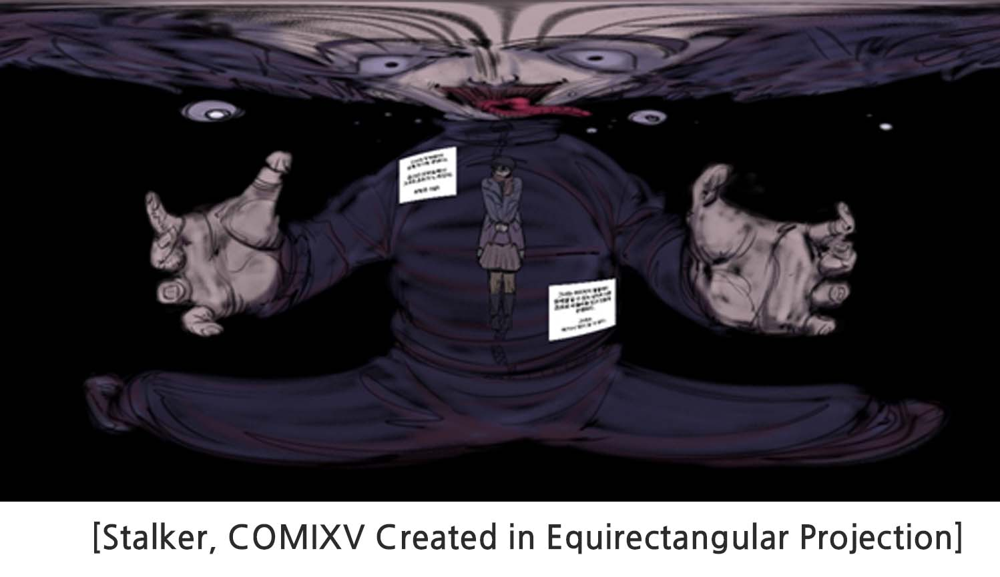

&nbsp COMIXV's VR webtoon requires a 360-degree spatial image. 360-degree images use a three-point perspective, which is less well-known than one- and two-point perspective images.

 
 

&nbsp Users view the images on the surface of a giant sphere and creators draw within the sphere development. However, not only the sphere development cannot exist mathematically, but also the distorted development creates an uncomfortable drawing environment. 

 
 

&nbsp Therefore, creators can create a 360-degree image in two different ways: a panoramic image, flattening the sphere image into a distorted rectangle or a 360-degree perspective cube image instead of a sphere. The following images below can be interchangeably converted through tools such as Flexify plug-in for Adobe Photoshop.

 
 

 
 

 
## 4.1.1. Equirectangular Projection

&nbsp Equirectangular projection is more often used in creating VR webtoons than cubic grid projection. This is because it is easier to draw at once. Also, practically the user has much more view range when turning his head rather than looking up, down, or behind. Besides, due to the nature of the 3dof environment requiring a lean-back environment, it is inconvenient to look behind. Hence, COMIXV's latest app provides a function to rotate the space through the VR HMD's remote control. 

&nbsp Equirectangular projection images are the standard format for VR markets. VR images or final projects from 360 camera uploaded on popular social media platforms such as Facebook and Google, all use this same format. .
	

 
 

### 1) Advantages of Equirectangular Projection

- At first, working on the isometric grid may be uncomfortable, but since the distortion in the center is not severe, it gets easier and simpler as your skills are refined. In addition, using SketchUp for background rendering will enhance your work smoothly as if you produce a plane webtoon.
- There is no need to use Photoshop because you can see your work in a piece and makes it easier to modify.
- In addition, the 360-degreed converted equirectangular projection background looks more natural when viewed with the VR.

 
 
### 2) Disadvantages of Equirectangular Projection
- <u>Creating the background could be a challenge at first.</u> The back of the image divides in half when you create a 360-degree image. Therefore, it is better if you do not place an image behind the background and make sure there is not any distortions when all images are added up together.
- Limitation occurs when trying to create a panel that needs renderings above, below, or behind. There may be extreme distortions. 
- The latest Photoshop provides editing for VR to solve this problem. This matter will be discussed later.

## 4.1.2. Cubic Projection

 

&nbsp An image produced in the equirectangular method may be critically distorted like the image above. In this case, you can use the cubic projection.

 

### 1) Advantages of Cubic Projection
- The above sample from Stalker, a webtoon published at Comix V, presents the stalker’s depravity and the victim’s psychological fear. The image created through the equirectangular projection method raises difficult questions of how and where you should begin to work. Like the extremely distorted image above, it is easier to make it into a cube projection first; and then use Photoshop to filter into a 360-degree image.
- You don't have to worry about the distortion in the 360-degree image because you can use a filter that allows plane drawing on a cube development. Therefore, it is easier to access than the equirectangular drawing method drawn on a distorted grid from the beginning.
 

 

### 2) Disadvantages of Cubic Projection
- If a cubic image that is not drawn correctly on the grid composition is converted into a 360-degree image using a filter will seem as if it was drawn on a cube when viewed through the VR device. Unlike the equirectangular projection method looking natural, the curved part of the image appears to be angled. And it will look awkward in a round and natural looking backgrounds.
- The process of creating a cube image first, using a filter, and then modifying is inconvenient. It is difficult to see as a whole how the image projects and requires consumes time, frequently going back and forth to convert for further modification. 
- However, even though, we've used Photoshop's Flexify plug-in filter, creating cubic projection doesn't necessarily require Photoshop alone. Other graphic editing tools may have similar filters or plugins.
