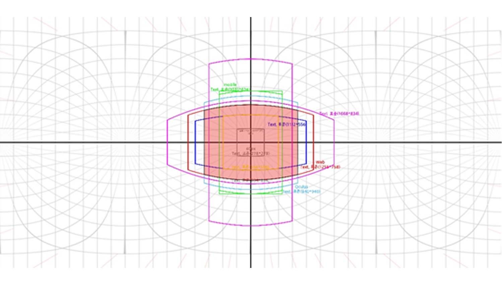
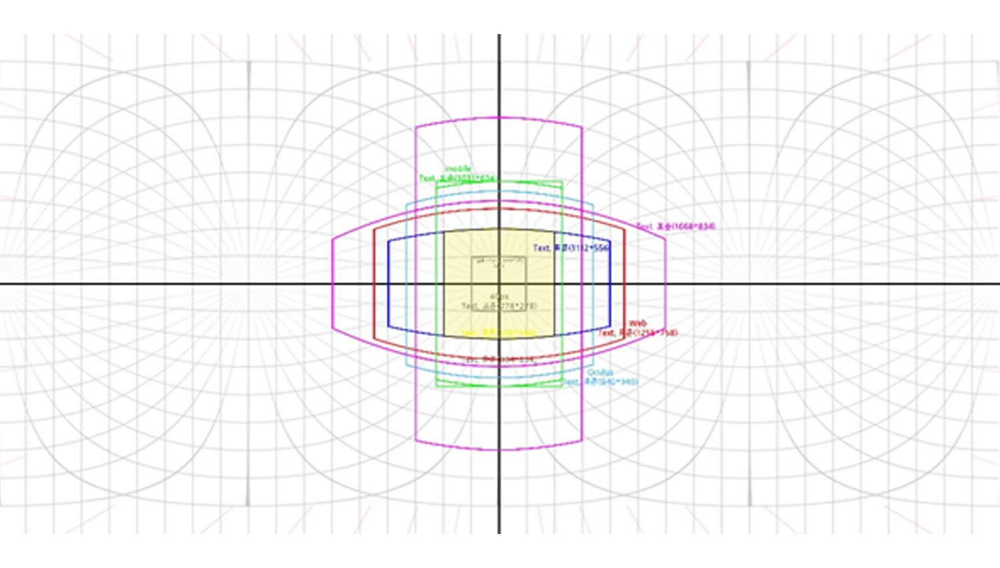
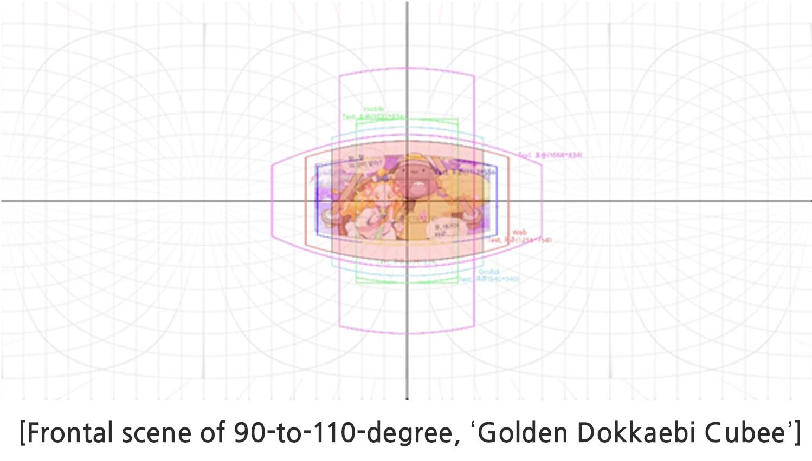
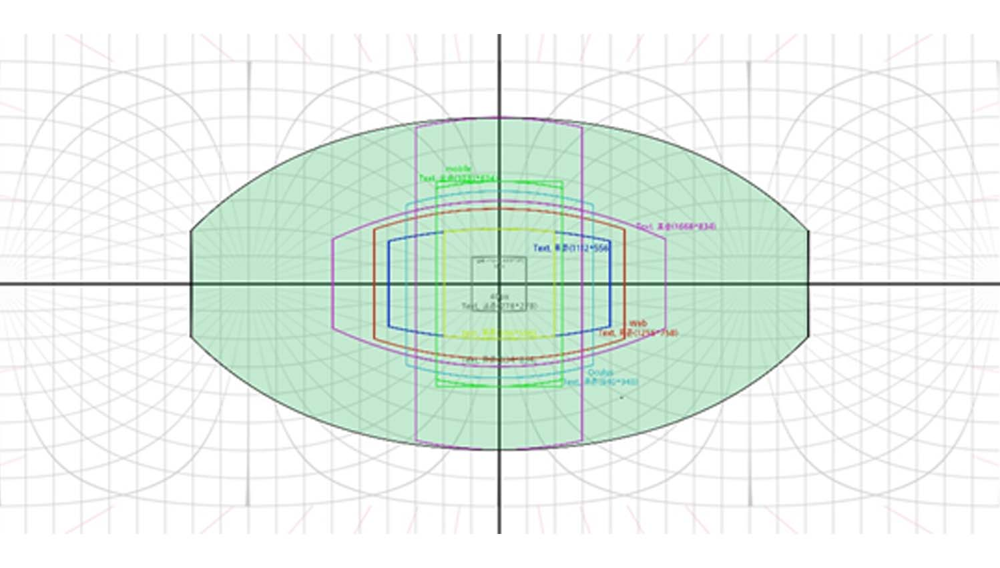
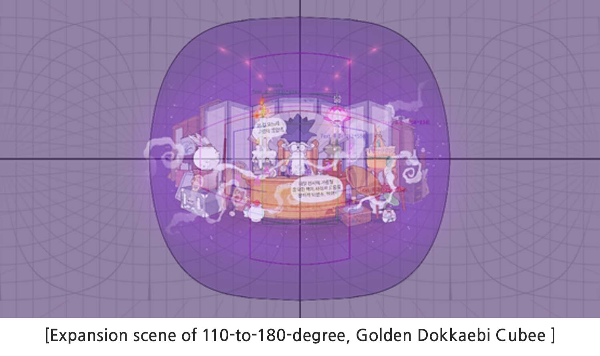
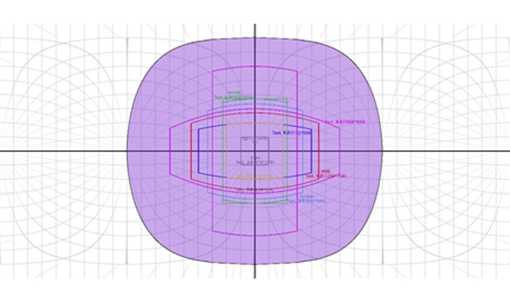
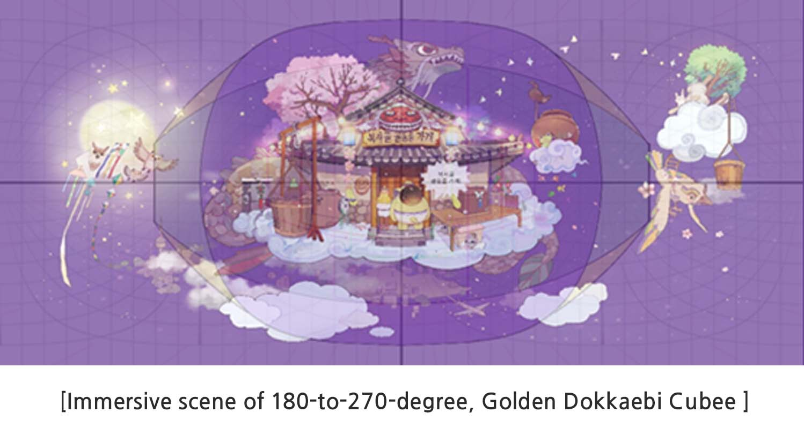

  

&nbsp The equirectangular projection method expresses a single image of the entire 360-degree space, and the area you can see right in front of you using an actual VR HMD is narrower than you think. The viewing angle that can be seen in VR instantly is called the field of view (FOV) and supports 90 to 110 degrees. Human natural eyes project 180 degrees horizontally and 120 degrees vertically.

&nbsp If you calculate 90-degree FOV, based on 4096 x 2048 px, the most appropriate visible area that includes margins is about 750px. It is smaller than the width of 800px of Naver Line webtoon, and when viewed on an actual device, this image is visible on a 1280 x 1440 (Oculus Go) screen. The latest 4K VR HMDs with 4K supports monocular resolution 1920 x 2160. Therefore, in this case, when you create 8192 x 4096 equirectangular projection image, theoretically 2048px is appropriate. And the actual comfortable viewing size is about 1500px. VR webtoon expects to be improved to the point of 16K, the standard human eye.

|Divisions|Human Eye (202X)|VR HMD(2019)|4K VR HMD (2020)|
|:---|:---:|:---:|:---:|
|Angle of View|180-degree|90-degree|100-degree|
|Resolution|Approx.100million|2.5K(2560*1440)|4K(3860*2160)|
|Monocular Resolution|10,000*10,000|1280*1440|1930*2160|
|360-Degree Horizontal Pixel Number   (Number of monocular pixels * 360 / FoV)|20,000|4,608|6,948|
|Recommended Equirectangular   Projection Width| 15,360 (16K)|4,096(4K)|8,192(8K)|
|Width within the FoV of   Equirectangular Projection   (Recommended equirectangular   projection width * FoV / 360)|7680px|1024px|2048px|
|Recommended Visible Contents Area|-|Approx. 750px|Approx. 1,500px|

 

&nbsp The red section above is the main visible part of the comic when the user reads with the VR Headset. Pose the most important part of the scene within the red colored grid if possible (Based on isometric projection 4096, 750~1000px).

&nbsp These sections will guide you how you should distribute and position your work. You are not strictly restricted to this grid; however, this will improve your positioning mistakes such as putting a background away from the center section, or distributing word bubbles where users can’t see. Therefore, be sure to check the flow and distribution of word bubbles, backgrounds, and items in your image.

&nbsp The yellow section above is the center when you view the image on the VR Headset. Inserting a vertically long image requires wider head movement, which causes discomfort, and lose viewer’s focus. Therefore, we recommend not going over the pink grid as much as possible.

&nbsp The green section above is the end of the comic and it can be seen when the user turns their head all the way to the left and right.

&nbsp The colored section can be seen when the user completely looks up or down and turn sideways.

&nbsp These sections can be seen while standing still with the VR Headset. All background, person figures and such other important aspects you intend to show should be within these sections when you create 360-degree image.

