## 4.3.1. Continuous Panels

&nbsp You can turn 360-degree pages in VR webtoons. Transition effects in certain area to express animation or passage of time like in webtoons can be applied in VR webtoons too.

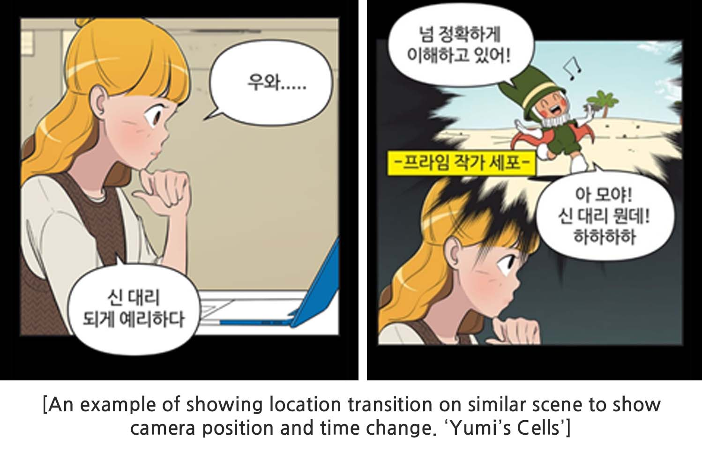

(Naver Webtoon, <i>Yumi's Cells</i>. Donggun Lee. Retrieved from https://comic.naver.com/webtoon/list?titleId=651673&weekday= )

 

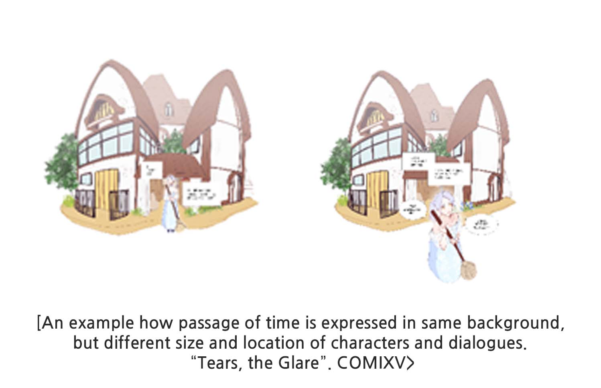

* It is more efficient for VR webtoons to express passage of time through fixed backgrounds and transitions in characters.

 
 

## 4.3.2. Paneling 360-Degree
&nbsp 360-degree background gives advantages in delivering atmosphere, adding deliberate storytelling through panels around it.

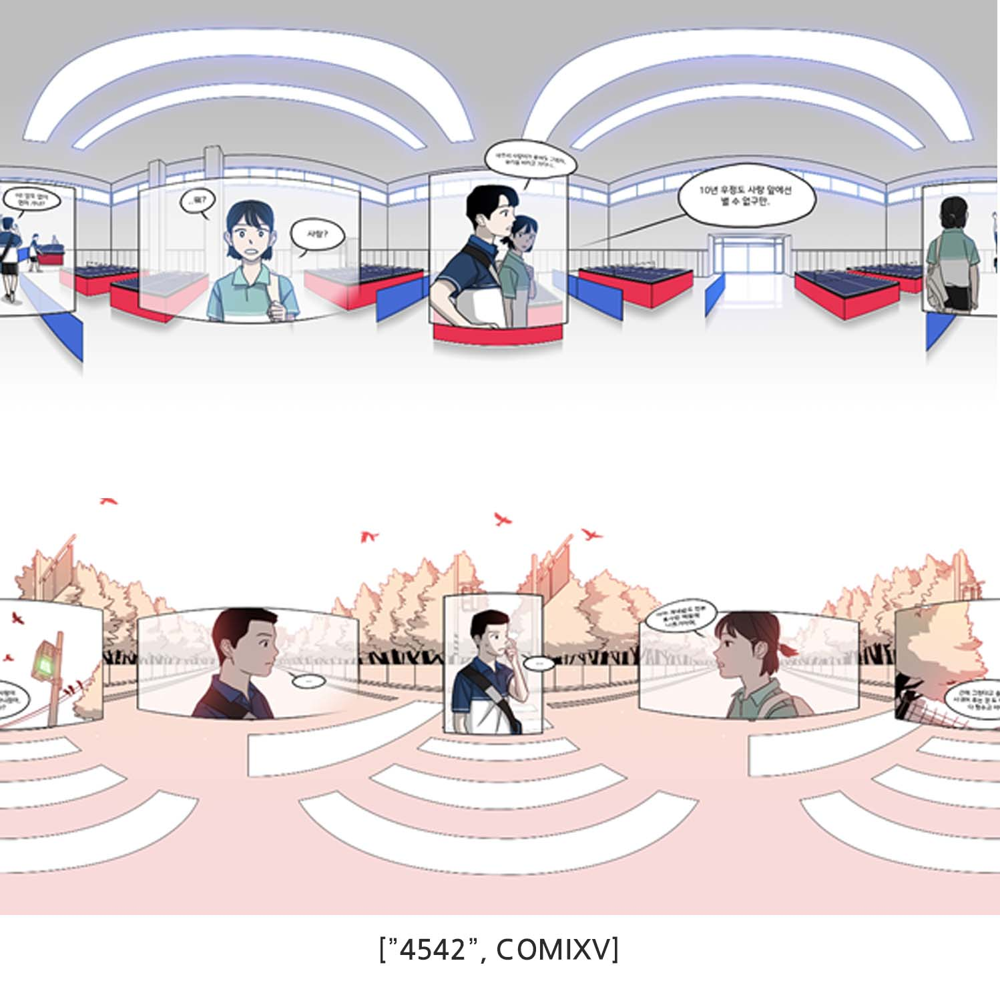

 
 

## 4.3.3. No Distortion Effects on Speech Bubbles
&nbsp Putting a panel in front requires much work making distortions in Photoshop GRID. If you apply distortion to the speech bubbles it may seem flat, but instead readability drops. Equirectangular images have same length of sides from the center of the sphere. So, if you apply flat speech bubbles, all of them will have the same side length to the user’s visual point and thus increase readability and also easier for typesetting or translation. Apart from the distortion, it also brings out depth.

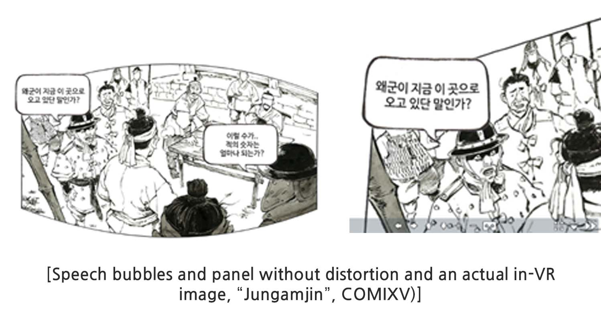

 
 

## 4.3.4. Left-to-right Organization
&nbsp Generally, deliberate reading sequences in published comics flow left to right and adapted mostly worldwide. Therefore, we recommend organizing panels left-to-right when creating VR webtoon. 
  * Our services in Japan adapted right-to-left layering and formatted dialogues vertically.

  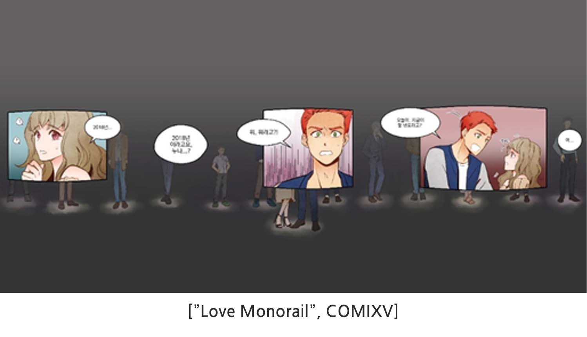

  Love Monorail, shown above, rotates from the front to the right to show three scenes and word bubbles in order. In addition, you can emphasize your cut scene by solely placing it at the front grid. 

 

&nbsp Followings are things you may need to keep track of: 
- the focus should shift from the center to right, and the image on the left—the last panel or dialogue in the order should not be visible from the center. 
- make sure to place the next panel and dialogues in view from the first panel so that the viewer naturally shifts right toward the appropriate sequence.

 

Below is an example of five panels in a VR webtoon scene applied with organizing tips above.

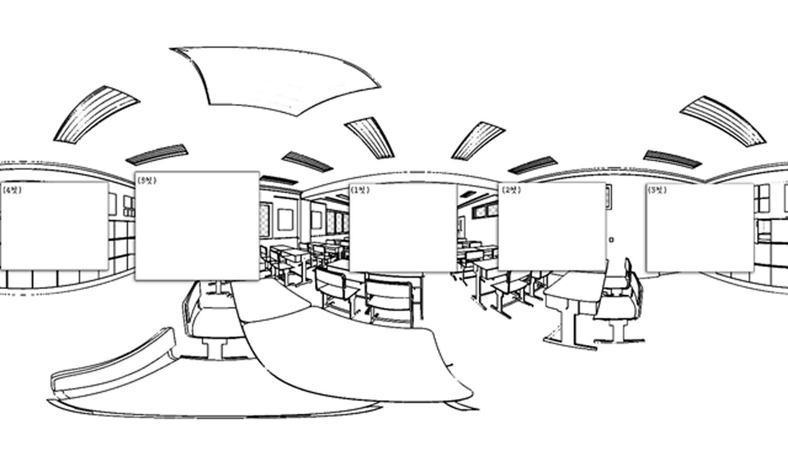

The fifth panel is distanced from the first cut so that when the viewer is facing the first panel, he won’t be able to notice that fifth one. Also, the fifth panel is stretched to amplify. 

The cropped area is organized in between the third and fourth panel for easier drawing.

 
 

## 4.3.5. Effective Layout Flow: Viewpoint
You can create interesting results using the flow of reading sequences.

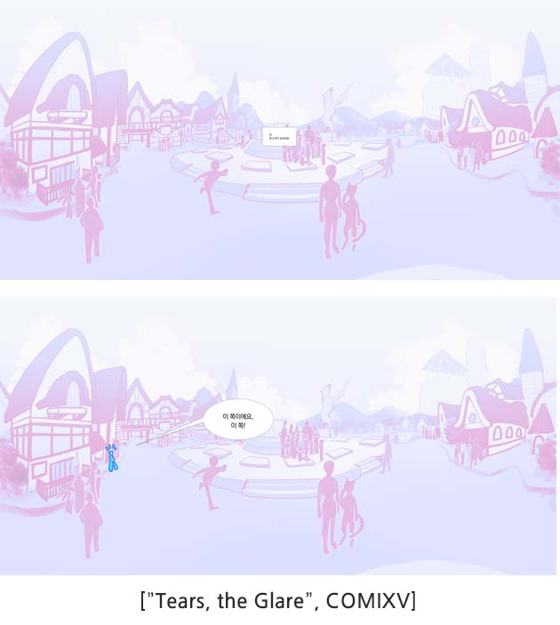

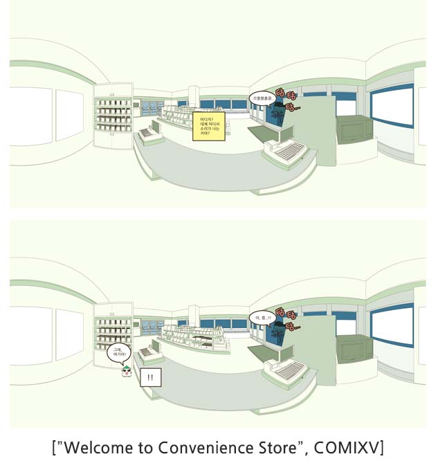

 
 

## 4.3.6. Effective Layout Flow: Space

You can place images carefully in a 360-degree space to create realistic qualities. 

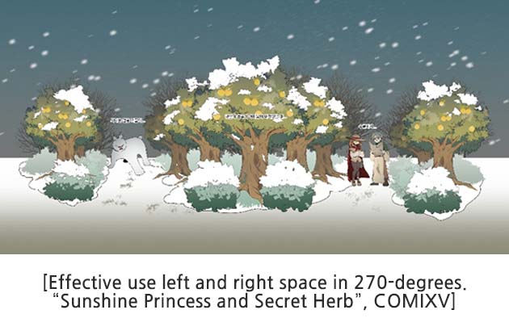

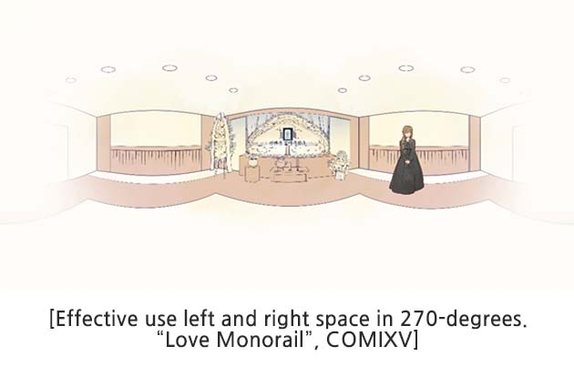

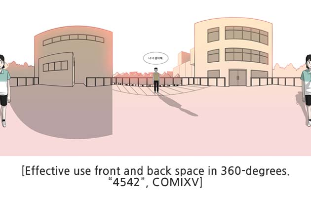

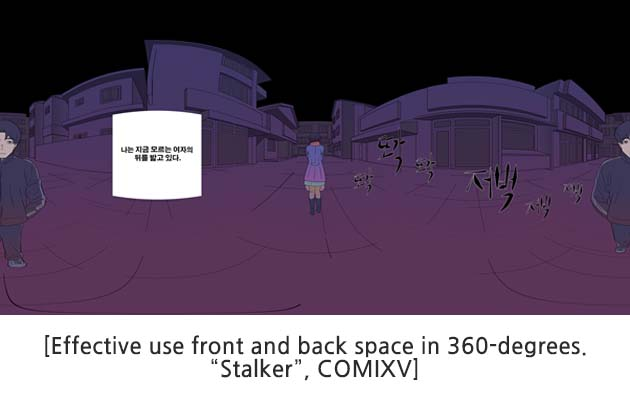

When you draw in a 360-degrees be cautious of the cutting planes and it is best to cut in half. 

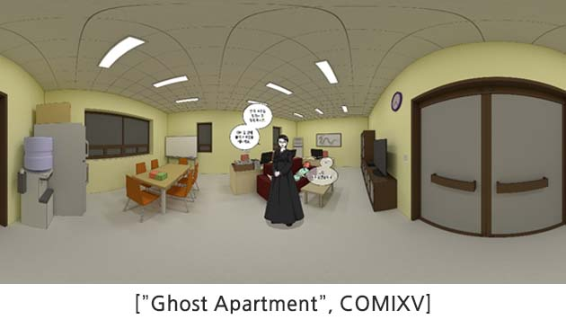

 
 

## 4.3.7. Effective Layout Flow: Space Expansion
Images inside the panel expanded to a 360-degree space brings out higher immersion. However, be careful not to lose focus from reset when turning to the next page. Going to the next page triggers the user’s focus to go back to the front.

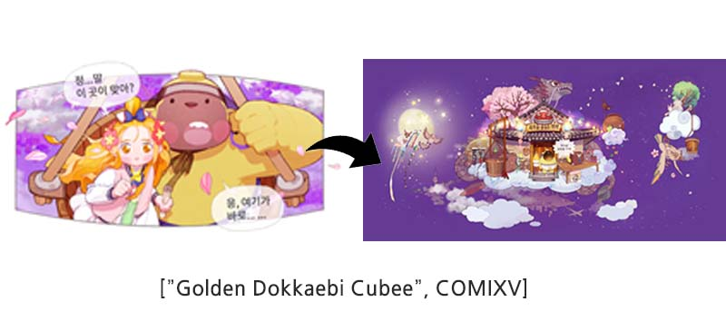

 
 

## 4.3.8. Effective Layout Flow: Continuous Events
You can effectively express a continuous motion by utilizing the 360-degree space scrolling horizontally—an advantage in VR webtoon.

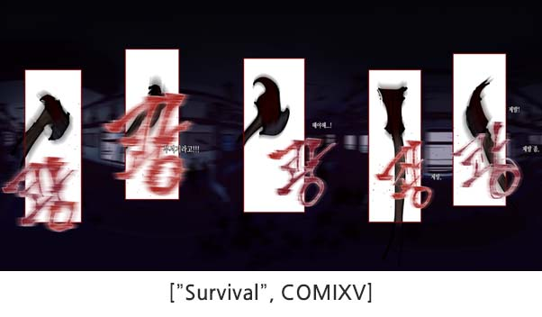

