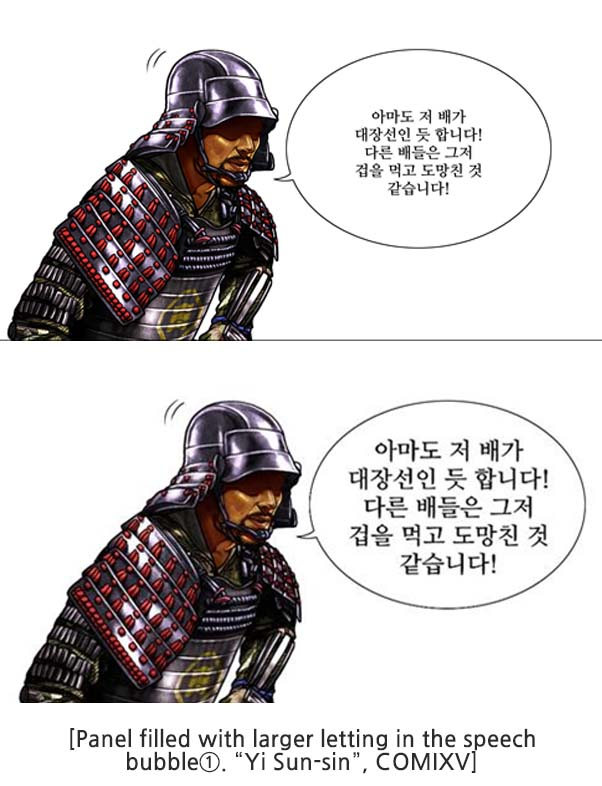
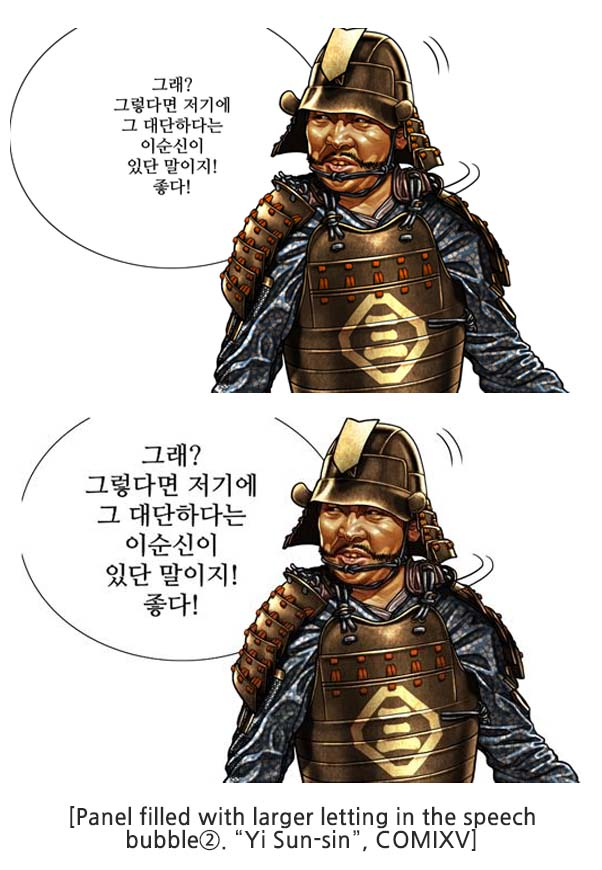
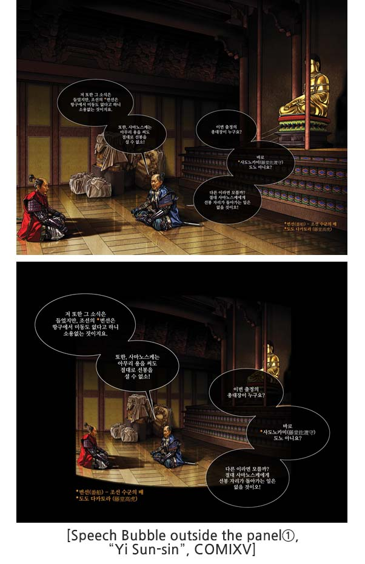
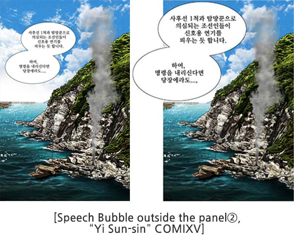

Published comics flow horizontally like VR webtoons but, they have different reading sequences. For example, published comics have everything inside the panels whereas panels in webtoons sometimes use up the spacing. Therefore, editing dialogues into appropriate layouts and organization is required. We will provide such tips below.

## 5.1 Dialogue Layout and Sizes

Webtoon effectively uses spaces between the panel and are large that a dialogue itself sometimes becomes a panel. Users using mobile phones to view webtoons are increasing which means smaller sizes of fonts will drop readability and concentration.

So, when adapting published comics to VR webtoon size up the dialogues in a speech bubble up about 80 to 90%. If you are working on a 4096*2048 canvas default font sizes to 18pt to 20pt. Also, try not to overload dialogue in a single panel over 60% and make the use of spaces to place dialogue over them for effective reading flow.

