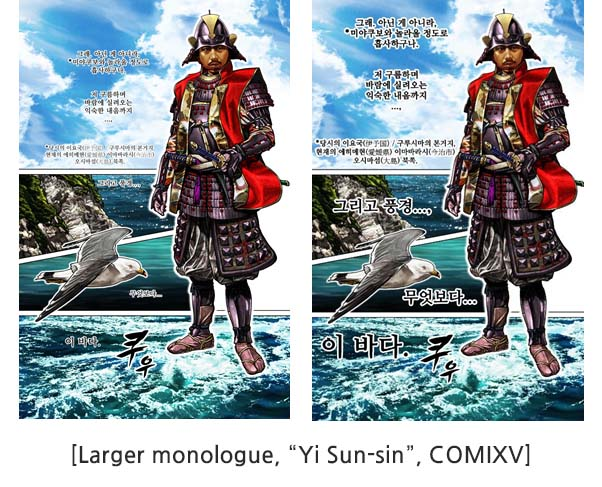
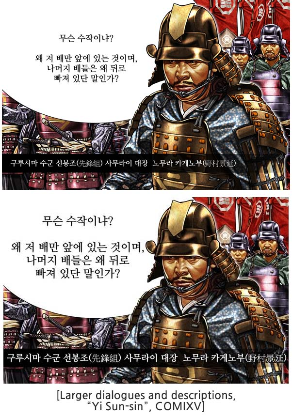
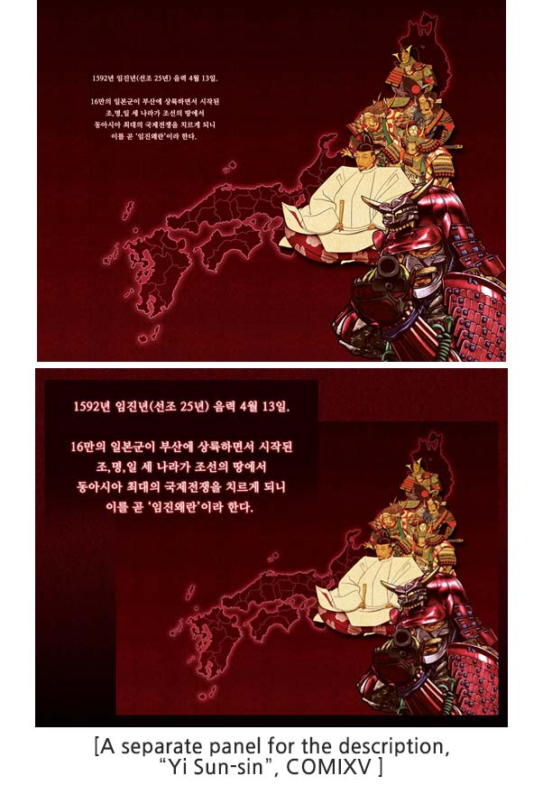
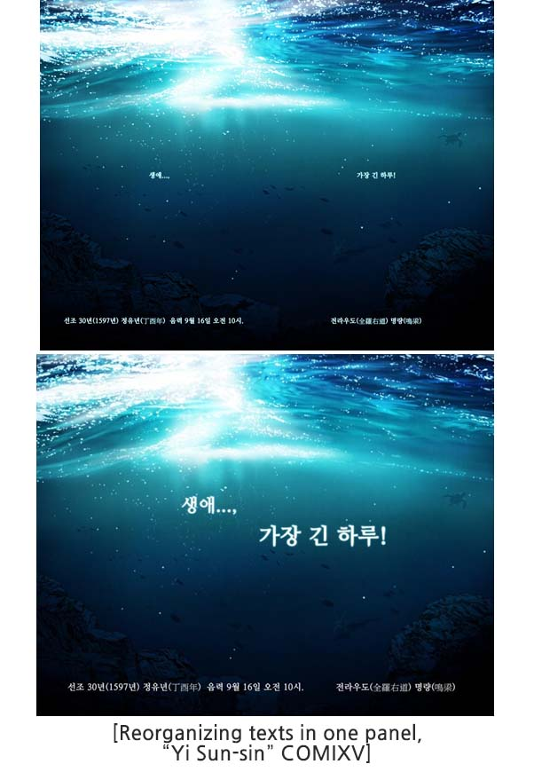

Letters in long monologues or descriptions may be smaller in size that results in poor readability. Use the spacings between panels enough that they don't cover drawings. When you're working on a 4096*2500, it's best to set the font size to 20pt or over.

Sometimes the text may get longer that you can't fit it inside the panel without covering the drawing. In this case, you can create a new panel with a similar background and paste the text inside it. Also, it's best to organize dialogues in similar reading sequences.

For example, when texts are organized horizontally and separated with the image, then it can be edited vertical for more effective layouts.