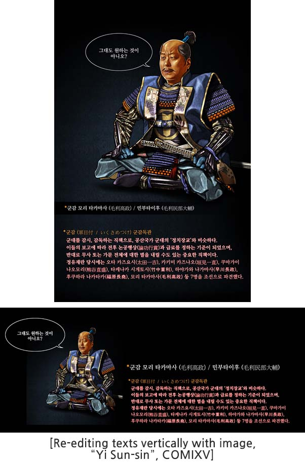
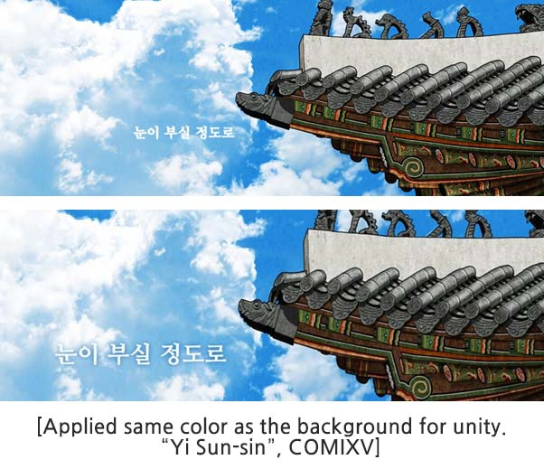
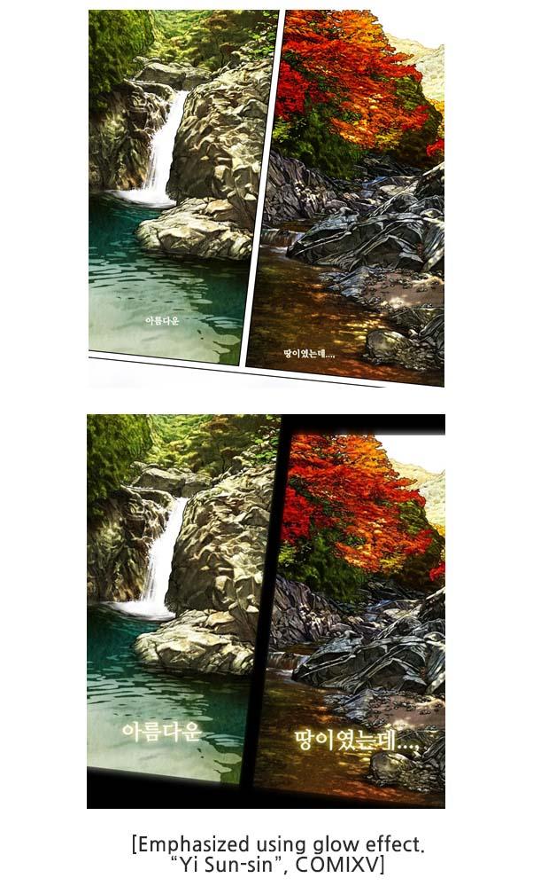
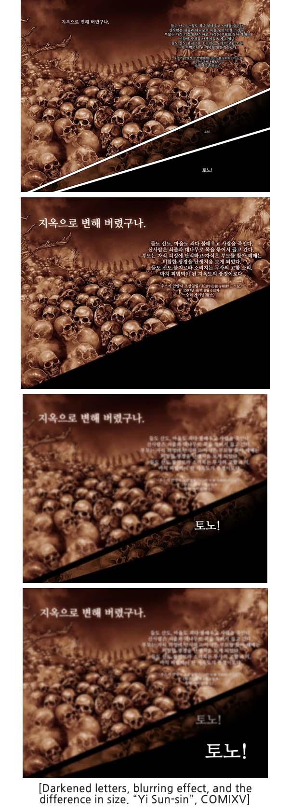

Enhance dialogues--also a part of elements of comics.  Edit them according to the atmosphere of each panel for effective higher readability and immersion. Adding similar color effects with the background will bring out unity overall. And if you change the boldness with darker colors will give you stronger effects.  

 
 

Make the dialogue like a drawing and apply blurring effects and change sizes to show the passage of time as well as depth.