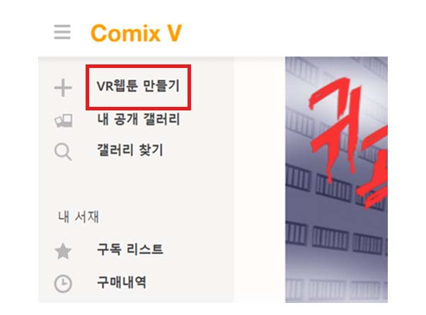
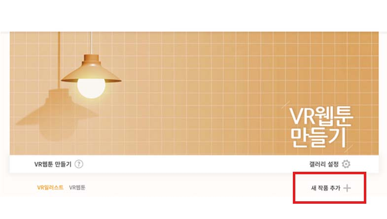
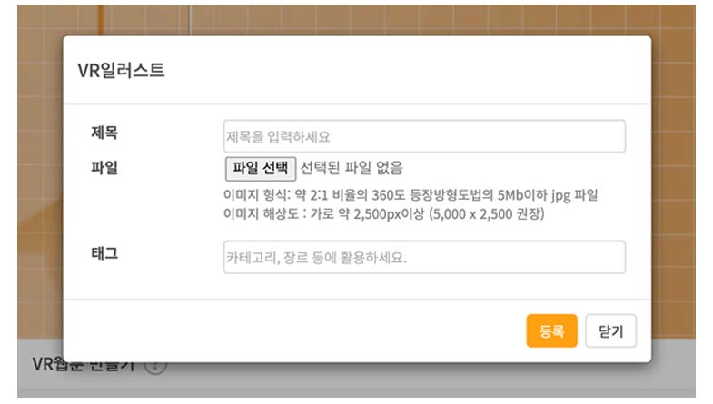
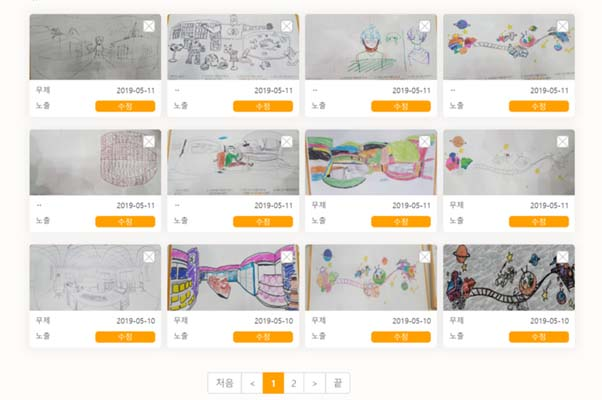
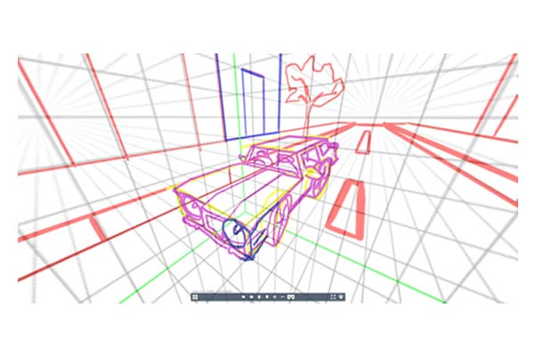
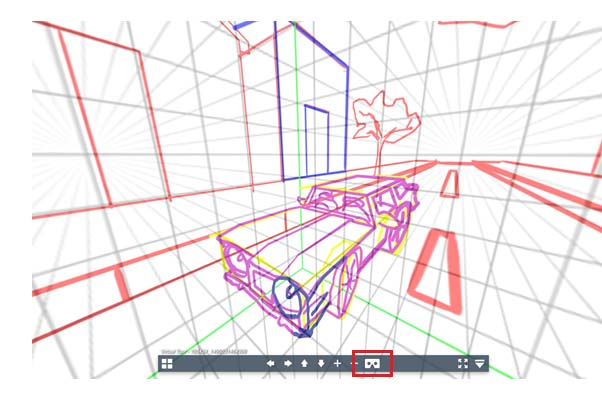
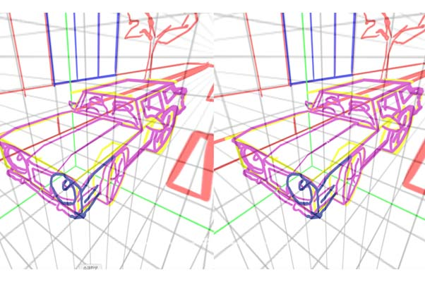

COMIXV currently provides trial opportunities to upload one 360-degree image or VR illustration at a time.

1)  Go to https://www.comixv.com/register and Sign In

2) After logging in, click Create VR Webtoon on the menu.

3) Click Add New Project on the Illustration tab.

4) Type in a title and hashtag, then upload your file.

* It may take a while to upload your work and create a 360-degree preview. The format of your image should b 4096x2048 JPEG with a 2:1 aspect ratio. If you are uploading a picture from your cell phone, especially iPhones, be make sure to save it in PNG format so that the resolution will not drop.

5) Check the result of your work, once it is upload to the gallery.

6) Like the screenshot above, you can view the image converted into 360-degree.

7) Press the cardboard icon to view your work in VR HMD mode. Images will be divided into two. You can also insert a gallery number to see VR webtoon images open for public in the latest version of COMIXV application.

