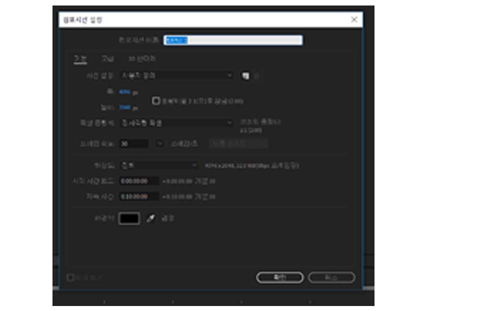
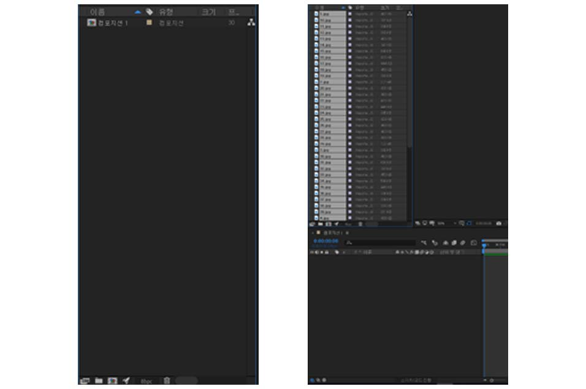
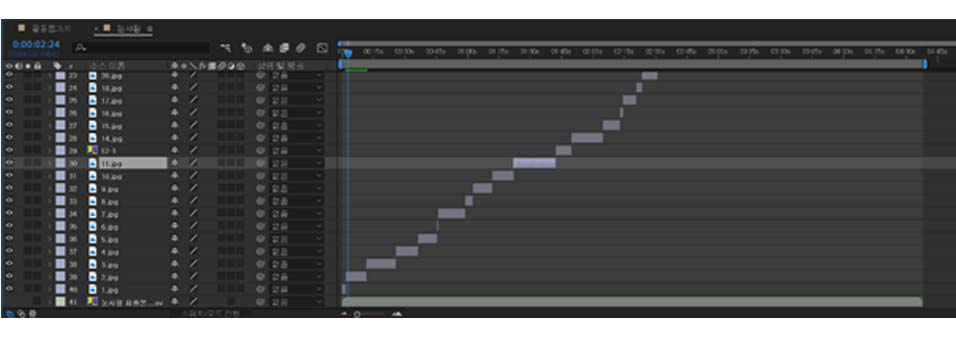
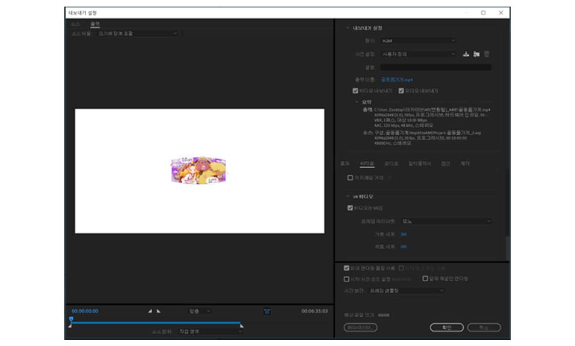

**Convert your continuous 360-degree VR webtoon images into a video to promote on social media. You can create a more efficient and at low-cost VR animation by adding dubs to it.**

* To create a 360-degree video, you’ll need **Adobe After Effects** and **Adobe Media Encoder**.

> 1) After running Adobe After Effects, create a new composition. Make a 4096x2048 and modify time according to your video length.

> 2) Open your webtoon JPG file by clicking on the right mouse button on the left screen.

> 3) Drag your JPG and sound files to the left below.

> 4) Adjust each item to an appropriate time and paste them in order as a piece. Adjust them according to the length of the file or your choice of editing.

> 5) If your complete Go to File -> Export and click Adobe Media Encoder for rendering to begin.

> 6) Under VR Video, check the box that says Video is VR. Once you are done and click Done. Now your video will be rendered into a 360-degree product.

