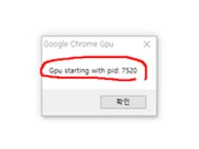
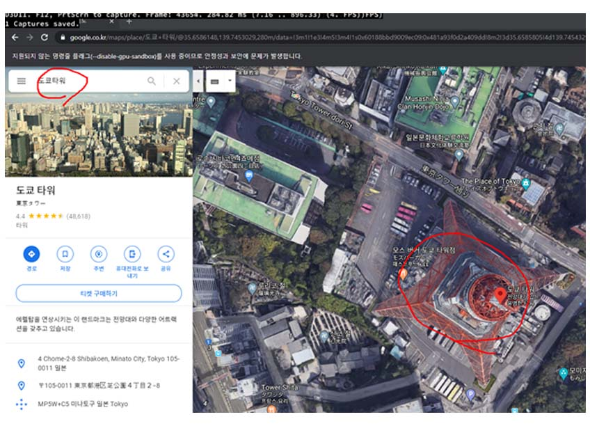

-----
## 8.1.1. Settings dd

> 1) Install the lastest version 1.8 of RenderDoc. Refer to the attached file or go to [RenderDoc](https://renderdoc.org/builds).

>> 1-1) Click **_Next_**.

>> 1-2) Check the box and click _Next_.

>> 1-3) Select Typical, then click _Next_.

>> 1-4)  Click _Install_.

#### 2) Installing Blender 2.8

> 1) Click [here](https://www.blender.org/download/Blender2.82/blender-2.82-windows64.msi/) to go to the download page.

#### 3) Creating a shorcut for Chrome.

>> 3-1) Search Chrome in Windows, click the right button of your mouse.

>> 3-2) Click Open a File Location.

>> 3-3) Select Chrome from the file and right click on your mouse. Select Create shortcut.

>> 3-4) Select YES.

>> 3-5) Go to your desktop and right click on Chrome shortcut file. Select Properties and on the Shortcut tab, paste the following link in Target: 

> C:\Windows\System32\cmd.exe /c "SET RENDERDOC_HOOK_EGL=0 && START "" ^"C:\Program Files (x86)\Google\Chrome\Application\chrome.exe^" --disable-gpu-sandbox --gpu-startup-dialog

>> 3-6) If you have finished like the screenshots, then you are all set.

 
 
 

## 8.1.2. Opening Google Image

#### 1) Install Blender Add-ons, Maps Models Importer v0.2.2.

> 1-1) Click to download [MapsModelsImporter-v0.2.2.zip](https://github.com/eliemichel/MapsModelsImporter/releases/tag/v0.2.2) or refer to the reference section. 

> 1-2) Go to 'Edit -> Preferences'.

> 1-3) On the Add-ons tab, click install.

> 1-4) Install **_MapsModelsimporter-v0.2.2.zip._**

> 1-5) On the Add-ons search input 'imp' and then check the **_import-Export box._**

#### 2) Before continuing, please make sure to close all browsers. Also, be sure to go along the steps to convert Google Maps. 

> 2-1) Run **_RenderDoc._**

> 2-2) Check the <i>pid</i> number.  
  *Every <i>pid</i> number is created randomly, so do not click OK right away.

> 2-3) From RendereDoc's File tab select **_inject into Process_**.

> 2-4) In the <i>Refresh screen</i> insert your pid number, then click _inject_ at the bottom.

> 2-5) Press OK on your Chrome.

 *You sould hav administrator's mode and numbers like the below image. 

 

> 2-6) In your internet browswer put Google Maps on the search machine. Open Google Maps.

> 2-7) To change your Google Maps location, click on your location on your bottom right.

> 2-8) Set your location settings to United Kingdoms and save your settings.

> 2-9) Click the satellite on your bottom left on your screen.

> 2-10) On your bottom right, click on the globe on your bottom right. If you do, a compass will appear above the globe icon.

> 2-11) Now insert any location you want on the search machine in Google Maps. Be sure to search any locations rather than South Korea, because South Korea is out of limits.

> 2-12) From **_RenderDoc_** click Capture Frame(s) Immediately.

> 2-13) On your Chrome while holding on the left button of your mouse shake it right to left a little

> 2-14) Now click on the captured image in RenderDoc and check if Colour Pass#3 appears on the left panel in RenderDoc. If not, try again and make sure you’ve followed the steps above.

> 2-15) Now open **_Blender_** and click **_File_** tab and select **_Import_** and click **_Google Maps Capture_**.

> 2-16) Now import the **_RenderDoc_** file to Blender. 

> 2-17) You’re all set!

