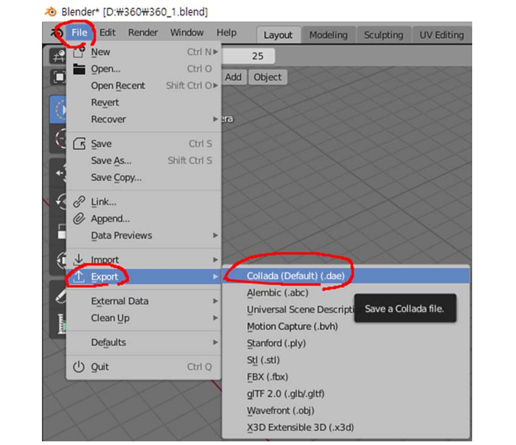
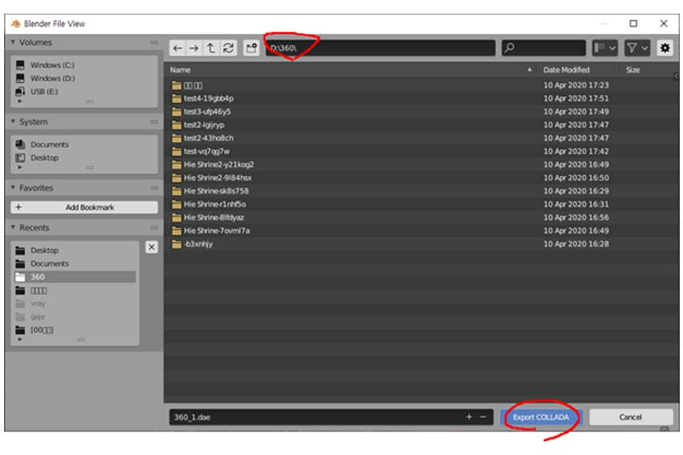
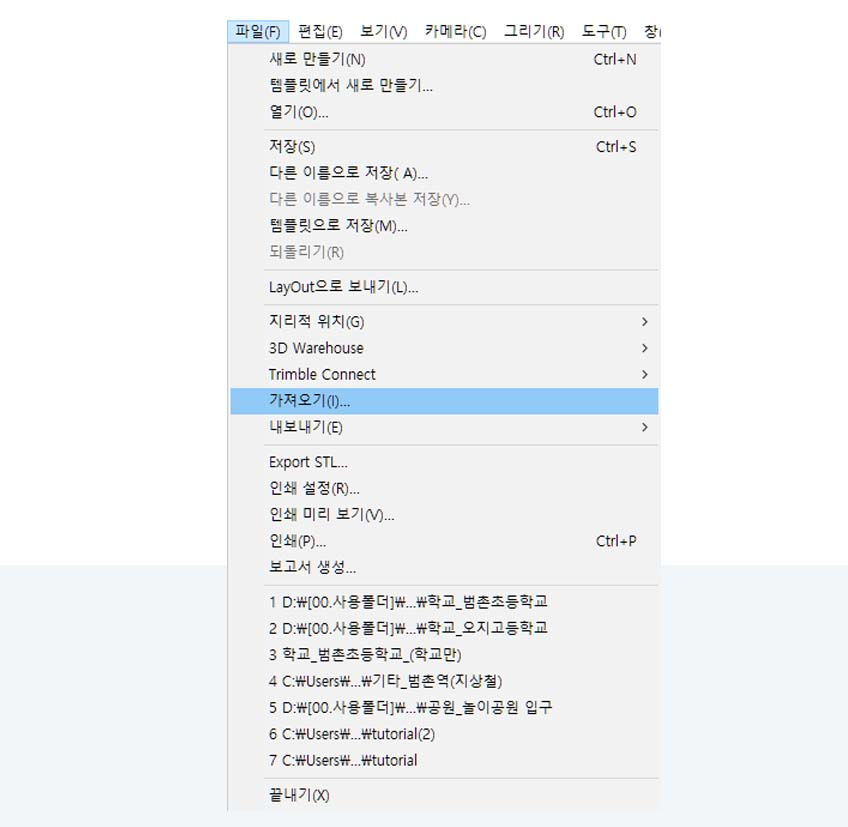
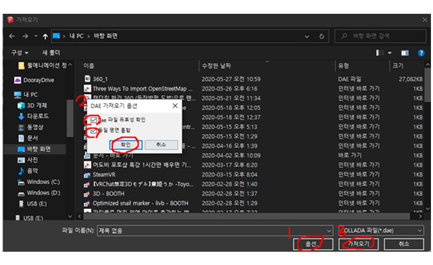

--------
## 8.2.1. Exporting from Blender

> 1) In Blender select File tab, select Export, and click Collada(.dae). You cannot use following formats: .stl and .3ds, etc. (still and .3ds, etc.)

> 2) Now export your file anywhere you want.

## 8.2.2. Importing to 

> 1) In SketchUp go to File tab and select Import.

> 2) From Options, check File validity and Conplanr Integration. Click OK to import.

