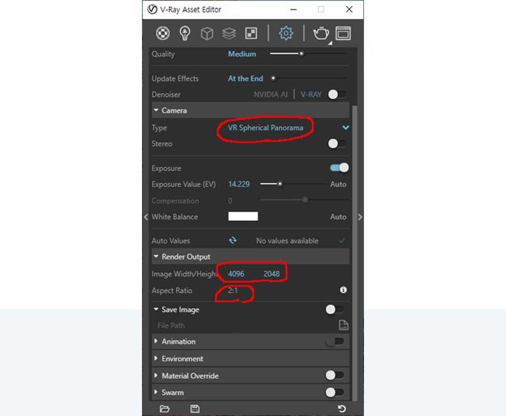

--------
## 8.3.1. V-Ray Basic Settings

#### - V-Ray Settings**

> - Camera -> Type : VR Spherical Panorama
> - Render Output -> Image width/ Heigh (Value set randomly)
> - Render Output -> Aspect Ratio (2:1)

