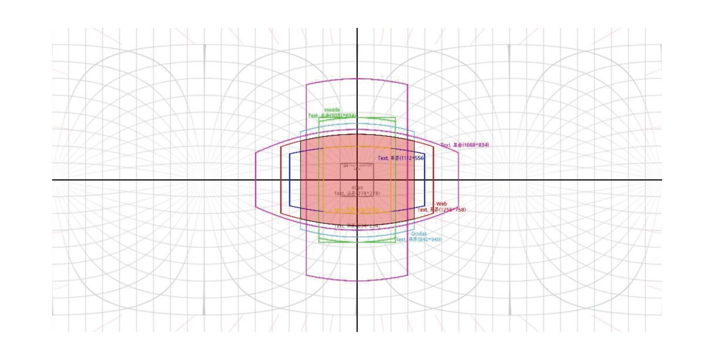
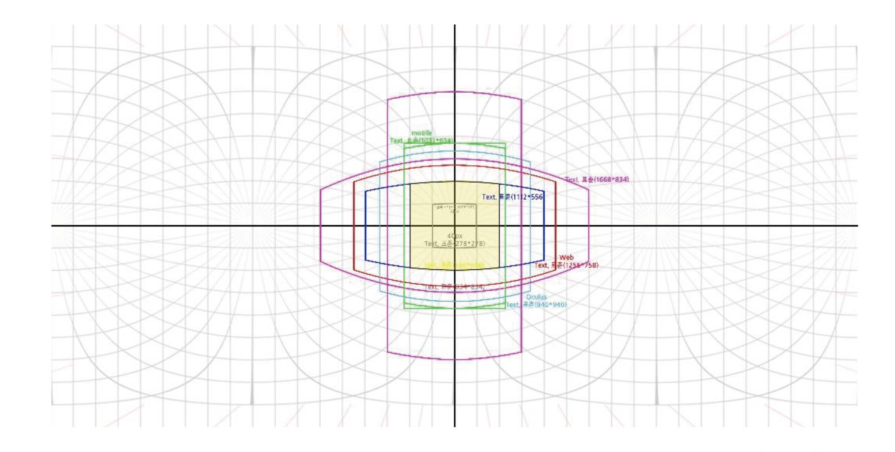
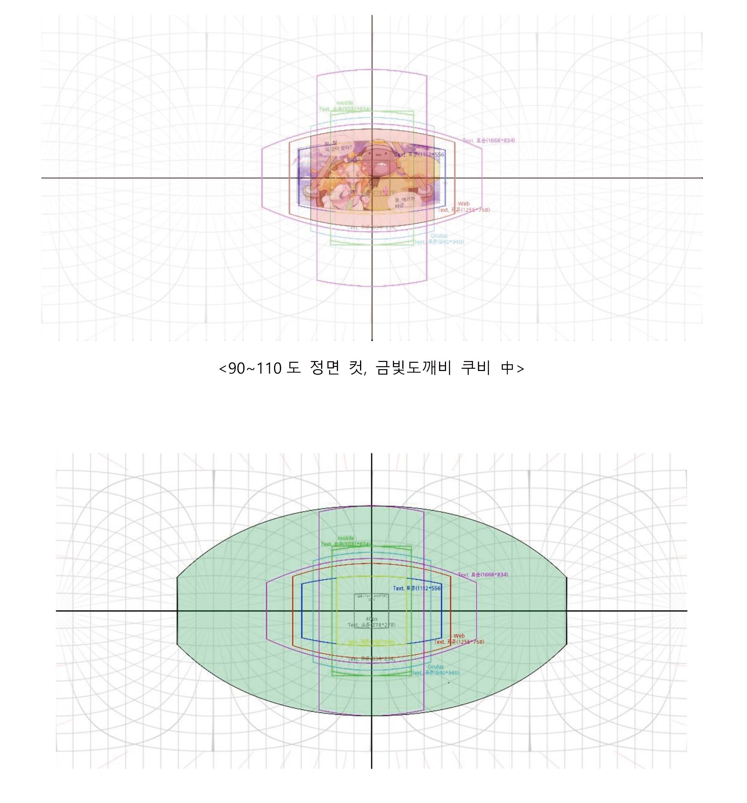
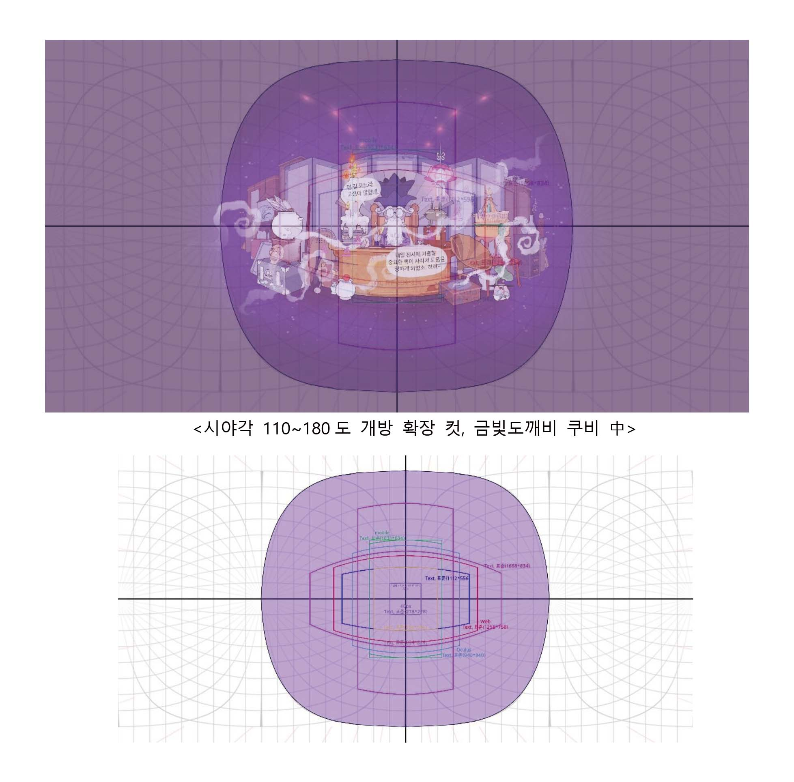
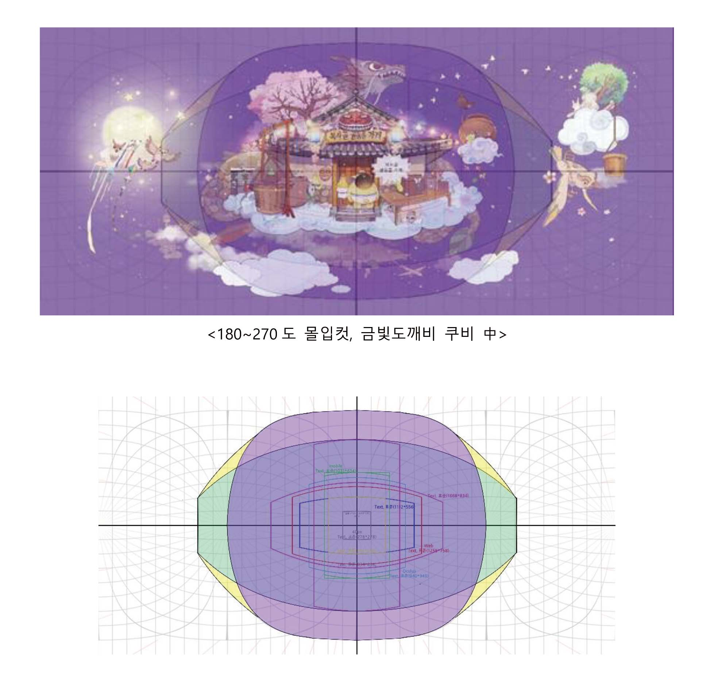

 

&nbsp 등장방형도법은 360도 전체 공간을 한 장의 이미지를 표현 한 것으로, 실제 VR HMD를 쓰고 눈앞에 바로 보이는 영역은 생각보다 좁은 영역입니다. VR에서 한번에 보이는 시야각을 FOV(Field of view)라고 부르며, 90~110도 정도를 지원합니다. 사람의 자연스러운 눈은 수평 180도,  수직 120도 입니다.

4096 x 2048 px기준하면 90도 FOV로 계산시 1024px이며 실제로는 여백을 포함해서 콘텐츠를 만들 때 약 750px정도가 적절하게 보이는 영역입니다. 네이버 웹툰의 가로 800px보다 작은 크기이며, 실제 기기에서 보일 경우, 1280 x 1440(오큘러스고) 화면에 이 이미지가 보이는 정도 입니다. 4k를 지원하는 최신 VR HMD의 경우 단안 1920 x 2160을 지원합니다. 따라서 이 경우, 8192 x 4096 등장방형 도법으로 제작시, 이론 상으로는 2048px 크기, 실제 편안히 보는 크기는 약 1500px크기로 생각하는게 용이하며, VR웹툰은 향후 사람 눈의 기준인 16k수준 까지 향상 할 것으로 예상됩니다.

| 구분 | 사람눈(202X) | VR HMD(2019) | 4K VR HMD(2020) |
|--- |:----:|:---:|:---:|
|시야각|180도|90도|100도|
|화소수|약1억|2.5k(2560*1440)|4K(3860*2160)|
|단안 화소수|10000*10000|1280*1440|1930*2160|
|360도 환산 가로 픽셀수 (단안화소수 * 360 / FOV)|20000|4,608|6,948|
|권장 등장방형도법 가로크기|15,360 (16k)|4,096 (4k)|8,192 (8k)|
|등장방형도법의 FOV내 가로 크기 (권장등장방형도법 가로크기 * FOV/360)|7680px|1024px|2048px|
|한번에 보이는 권장 콘텐츠 영역|-|약 750px|약 1500px|

 

&nbsp위의 구역은 VR기기로 만화를 관람했을 시 한 눈에 들어오는 구간입니다. 중요 콘텐츠 배치는 붉은 그리드 내 (등장방형 도법 4096기준시, 750~1000px)에 배치하는 것이 좋습니다.

&nbsp 제공해드리는 등장방형도법 그리드는 VR기기로 관람했을 시 어느 구간에 그림을 그려야 한 눈에 보이는지 알려주는 그리드입니다. 연출에 따라 이 그리드는 반드시 지켜지지 않아도 되지만, 연출 실수로 인하여 그림이 중앙에서 벗어난 장소에 위치해 있거나 대사가 한 눈에 보이지 않아 대사의 순서를 모르게 되어버리는 상황이 생기게 됩니다. 그렇기 때문에, 대사의 배치, 컷의 배치, 연출 등은 한 번씩 확인해가며 작업하시는 것이 좋습니다.

&nbsp 위의 노란색 구역은 VR기기로 만화를 관람했을 시 중앙에 위치하는 구간입니다. 약간의 움직임으로 위쪽에 위치하고 있는 그림을 볼 수 있는 구간의 경우, 세로로 긴 컷을 넣어야 하는 경우에는 큰 움직임으로 봐야 할 시, 불편하고 시선을 잃어버릴 수 있기 때문에 분홍색 그리드를 과도하게 넘어가지 않도록 해야 합니다.

&nbsp 위의 구역은 VR기기로 작품을 관람했을 시 약 고개를 좌 우 끝까지 돌렸을 때 보이는 
구간으로 트인 공간 이미지를 표현할 때 사용할 수 있는 구간입니다.

위의 구역은 고개를 위, 아래로 완전히 들고 떨어뜨린 채 고개를 좌우로 돌려 바라볼 수 있는 구간입니다.
 

&nbsp 위의 구역은 VR기기로 관람했을 시 몸을 뒤로 움직이지 않고, 볼 수 있는 모든 구간입니다.  360도로 이미지를 제작할 시 위의 구역에 배경, 인물 등 반드시 보여야 할 그림을 넣어주는 것이 좋습니다.

