### 4.3.1. 연속 이미지를 이용한 변화 

&nbsp VR웹툰은 360도 페이지를 넘길 수 기능을 제공합니다. 네이버의 컷툰에서 페이지 전환 시 일부 영역만 변화시킨 이미지를 보여주어 애니메이션이나 시간 흐름을 표현하듯 VR웹툰도 이런 효과를 만들 수 있습니다.  

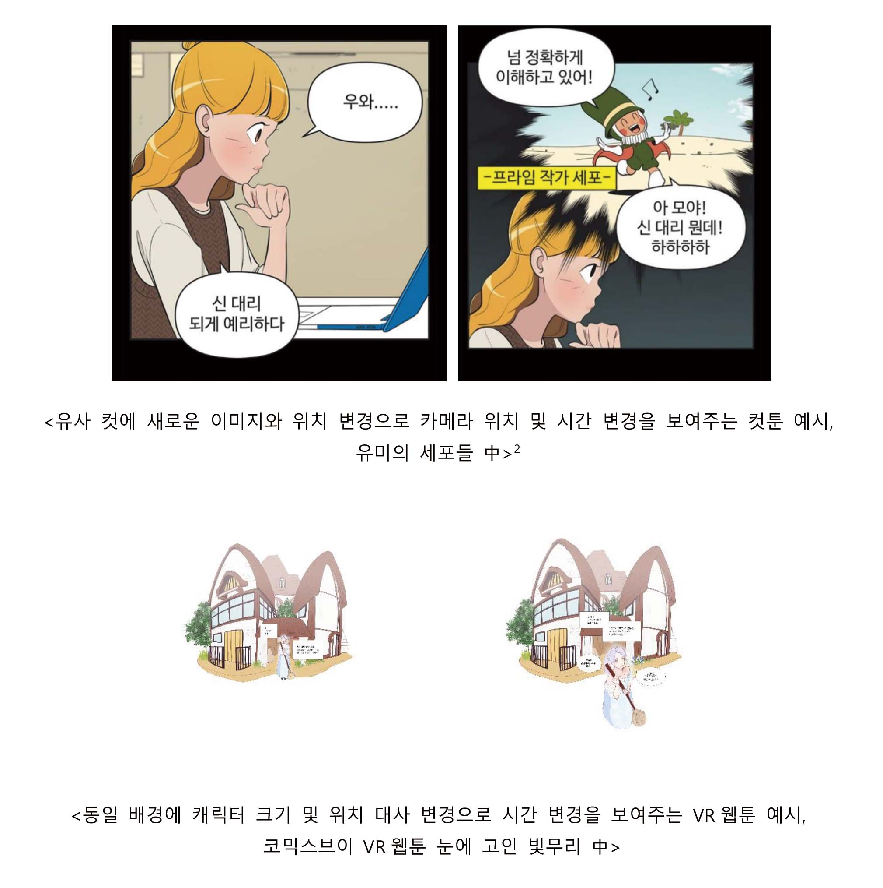

*VR웹툰의 경우, 배경을 고정하고 캐릭터들을 변화 시켜 시간의 흐름을 보여주는 연출을 쓰기에 용이합니다.

(네이버웹툰 : 이동건 作 유미의 세포들 https://comic.naver.com/webtoon/list.nhn?titleId=651673&weekday=)

 

## 4.3.2. 360배경위에 스토리 컷 이용

&nbsp 360배경은 공간에 대한 분위기를 전달하고, 상황이나 이야기는 컷을 얹어 스토리를 진행할 수 있습니다.

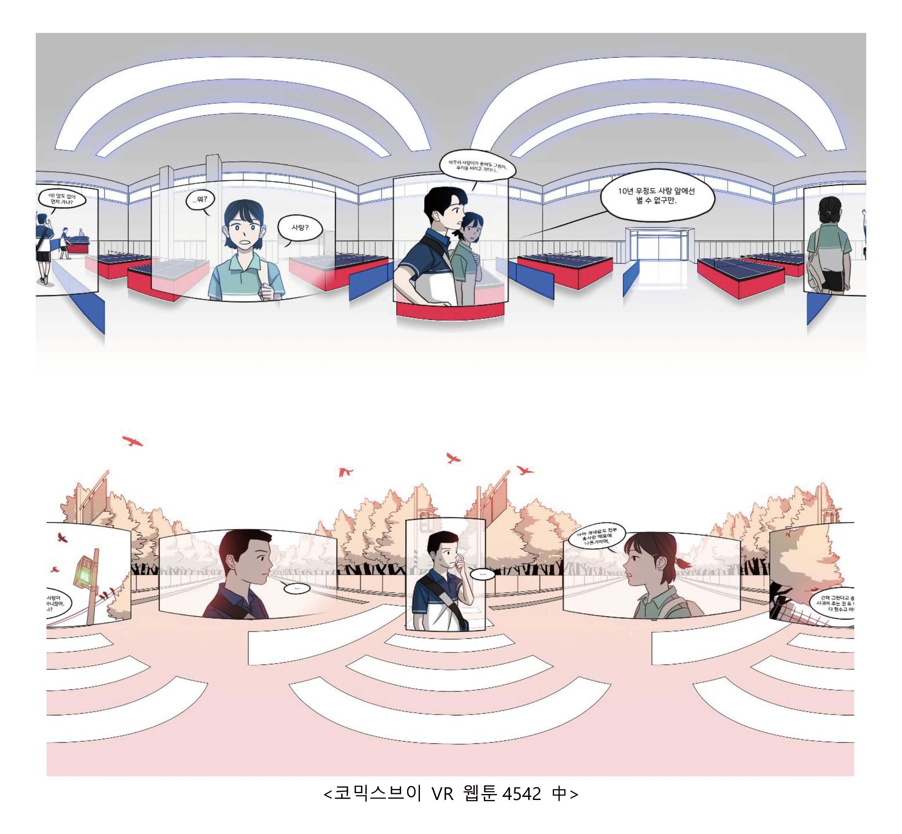

 
 

## 4.3.3. 말풍선에는 왜곡효과를 적용하지 않기
&nbsp 앞에 정면 컷을 배치하고 싶은 경우, 컷을 포토샵으로 GRID에 맞춰 왜곡하는 작업을 많이 합니다. 이 와중에 말풍선도 같이 왜곡을 하면 평평하게 보이는 효과는 있으나, 가독성은 떨어지는 효과가 있습니다. 등장방형도법의 이미지는 모든 면이 구의 중심점에서 같은 거리입니다. 따라서 평평하게 말풍선을 붙일 경우, 시선과의 모든 면이 동일한 거리인 구 형태를 띄게 되어 가독성이 높아지고, 추후 식자나 번역에 용이합니다. 또한 이미지의   왜곡과 별개로 입체적으로 보이는 부수적인 효과도 있습니다.

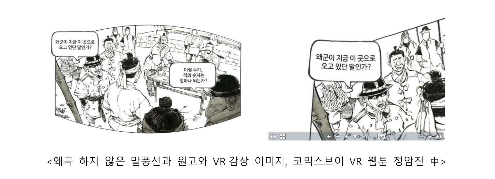

 
 

## 4.3.4. 좌에서 우로 컷 배열
&nbsp 출판 만화의 경우, 좌에서 우로 보는 형식으로 학습되어 있으며, 이에 대한 컷의 흐름 방식은 전세계에 가장 보편적인 방식이며, 이는 텍스트를 읽는 습관과 관계가 있다. 이를 그대로 이용한 방식으로 좌에서 우로 컷과 텍스트를 배열하는 방법입니다.  
    *일본어 서비스의 경우, 우에서 좌로 이동하며, 말풍선도 세로로 재편집 합니다.

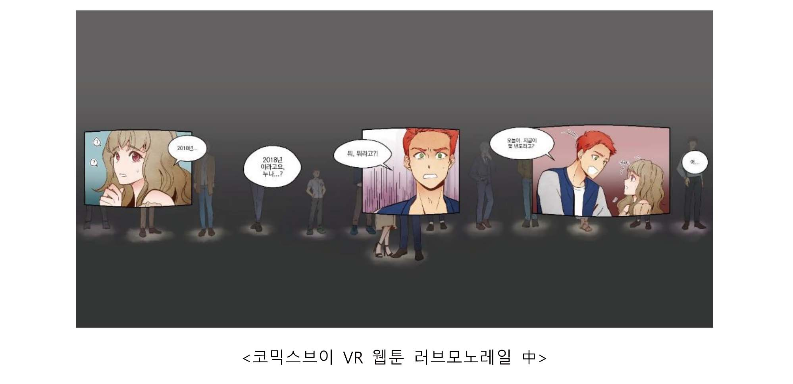

 

&nbsp 위에 제시된 작품 러브모노레일은 정면→오른쪽으로 회전시켜 3컷의 만화 및 말풍선을 차례로 보도록 연출하였습니다. 또 이처럼 ‘앞’ 그리드에만 칸을 배치하여 주요 컷을 보여주는 방식도 자주 사용되곤 합니다. 

이때 **주의할 점**은 아래와 같습니다.  
- 맨 마지막에 읽게 하고 싶은 글자 컷과 이미지는 정면에서 차이를 두어 정면에서 우로 시선을 이동하지 않게 합니다.  
- 순서대로 다음 컷, 다음 말풍선으로 시선 이동이 용이하도록 시선 이동시 다음 컷과 대사가 보여야 합니다.

위를 고려해서 만든 5컷 VR웹툰 틀의 예시입니다.

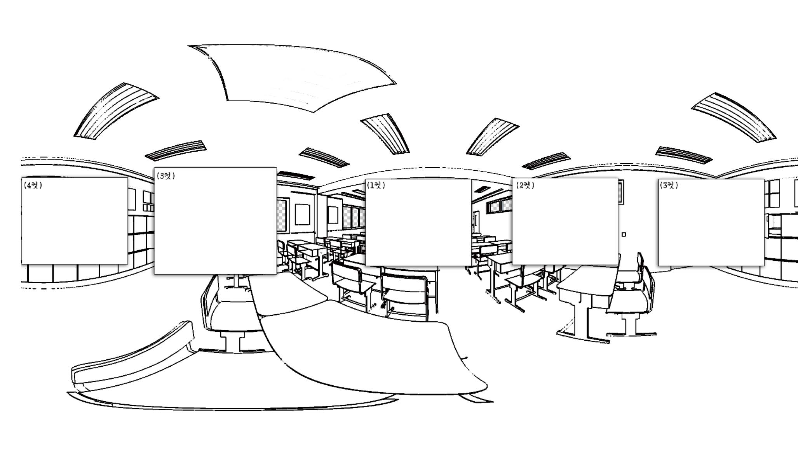

5컷은 1컷과 거리를 두어, 처음 볼 때 5컷이 보이지 않게 하였고, 5컷은 내용을 강조하기 위해 크기를 확대했습니다.   

뒤에 크롭되는 영역은 3컷과 4컷 사이에 위치하게 하여 그림을 그리기 용이하게 제작했습니다.

 
 

## 4.3.5. 장 별 시선 위치 차이를 이용한 연출  

이를 응용을 하면 독자의 시선을 유도하는 재미있는 연출을 할 수 있습니다.

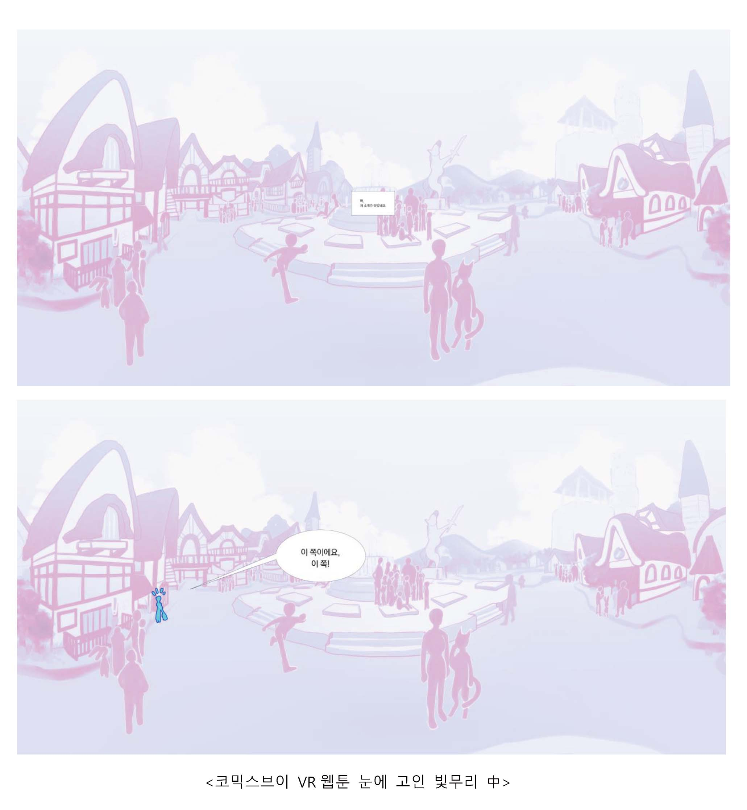

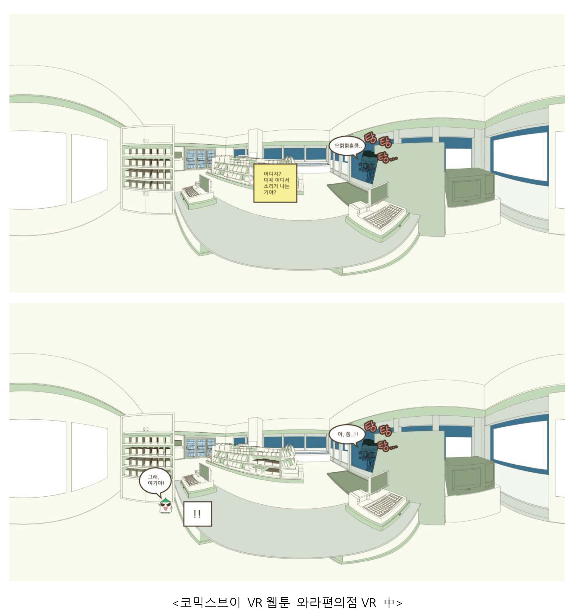

 
 

## 4.3.6. 공간의 위치 별 연출

360도 공간에 그림을 배치하는 것으로 공간별 위치를 이용하여 현장감 있는 연출이 가능합니다. 

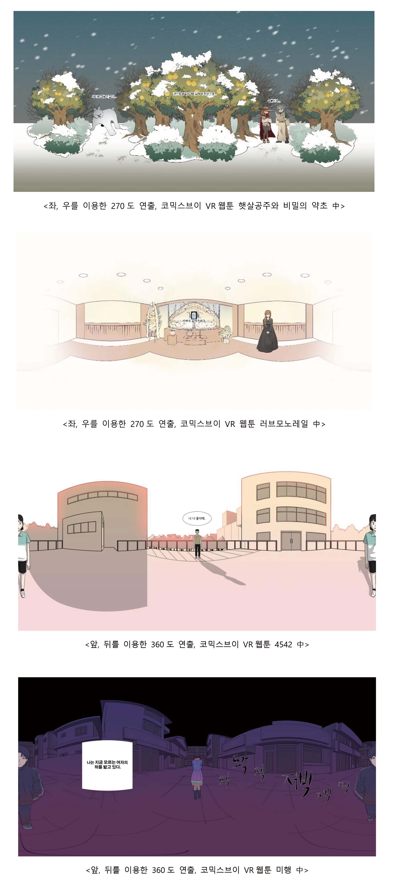

 
 

참고로 360도 이미지 제작 시에는 절단면을 주의하여 그려야 하며 절단면의 경우, 그린 후 반으로 자르는 것이 용이합니다.

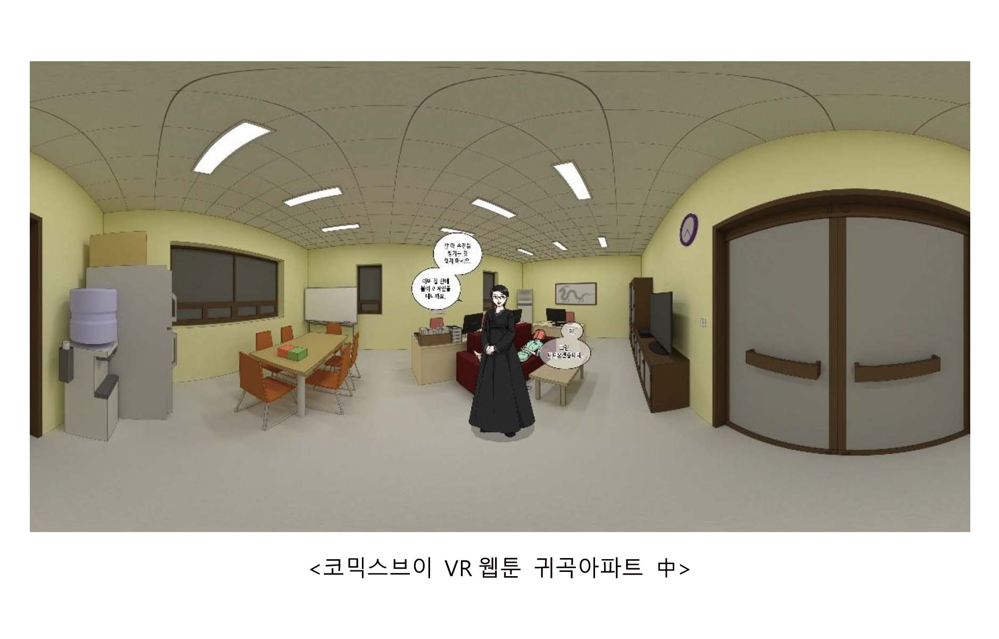

 
 

## 4.3.7. 공간 확장 연출의 극대화
컷 안에서만 이루어지던 장면들이 360도 공간으로 확장되면서 더 높은 몰입을 줄 수 있습니다. 다만 넓은 공간 이미지에서 페이지를 넘겼을 때 다시 정면으로 돌아오는 경우, 시선초기화를 이용하여 시선을 잃지 않도록 주의합니다.

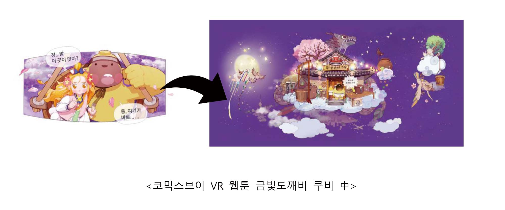

 
 

## 4.3.8. 효과적인 연속 동작 연출
가로로 스크롤 하는360도 공간의 특수성을 활용하여 연속 동작을 더 잘 표현하고 느낄 수 있습니다. 

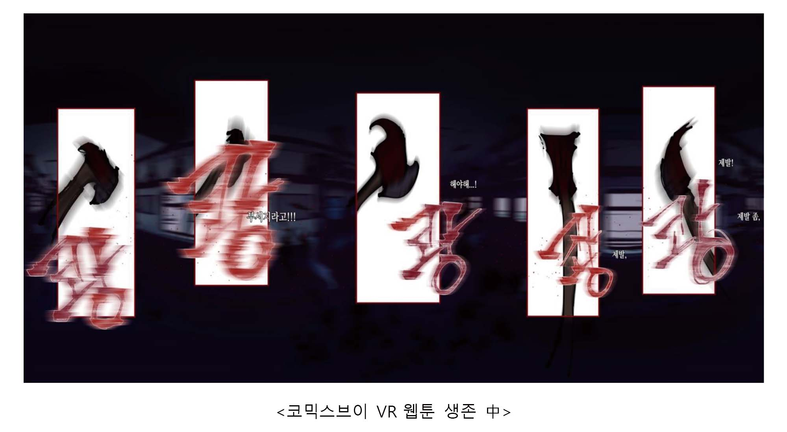

 
 