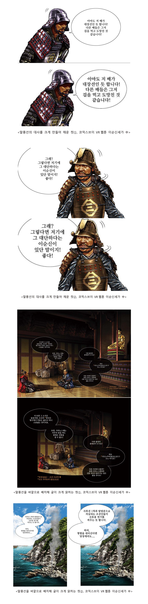

#### 출판 만화는 가로로 넘어가는 방식으로 VR웹툰을 보는 방식이 흡사한 부분이 있습니다. 하지만 책 넘김을 제외한 읽는 방향이 완전히 일치하지 않기 때문에 출판 만화와 VR웹툰의 연출 방식에 차이가 생깁니다. 특히 대부분 컷 안에 말풍선이 함께 들어가는 형식의 출판 만화와 여백을 이용해 말풍선을 넣는 웹툰과는 가독성의 차이가 생기기 때문에 이러한 차이를 줄이며 가독성을 높일 수 있는 대사의 정렬 및 배치 방법을 설명합니다.

## 5.1. 대사의 재배치와 크기

웹툰은 컷과 컷 사이의 여백의 활용도가 높습니다. 대사 자체가 하나의 컷이 되기도 할 정도로 크게 사용합니다. 모바일로 웹툰을 감상하는 이용자들이 늘어 글씨가 조금이라도 작아지면 가독성과 집중도가 떨어집니다.  

이런 대사들은 말풍선의 80% - 90% 정도의 비율이 될 정도로 크게 쓴다면 읽기가 한결 수월해집니다. 4096*2048 크기의 작업시 기본 18pt - 20pt 사이 정도의 크기로 써줍니다. 또한 대사의 비율은 전체 컷의 최소 60% 이상의 되도록 배치하는것이 좋습니다. 대사가 큰 만큼 웹툰의 남는 여백을 활용하여 과감하게 컷의 바깥에 두어 그림을 가리지않고 시선의 흐름이 자연스럽도록 유도합시다.

