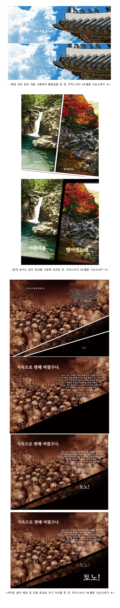

대사 또한 만화의 한 구성요소로 시각적으로 꾸밀 수 있습니다. 각 컷의 분위기에 맞추어 강조한다면 만화의 몰입도와 퀄리티를 높일 수 있는 효과가 있습니다.

컷의 배경과 같은 색상의 효과를 넣는다면 그림과의 통일감을 줄 수 있으며 두꺼운 굵기에 진한 색을 섞는다면 강한 인상을 줄 수 있습니다.

 

대사 또한 컷과 같은 그림으로 만들어 흐림 효과를 주면서 글자 크기를 다르게 한다면 좀 더 입체감과 시간적 흐름을 표현할 수 있습니다.

