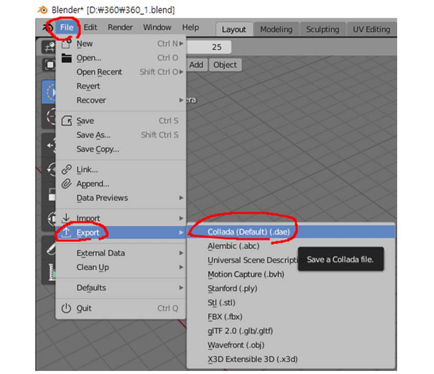
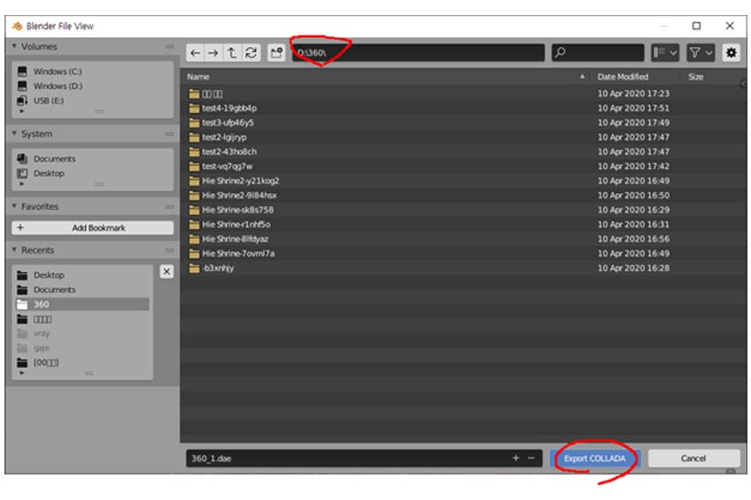
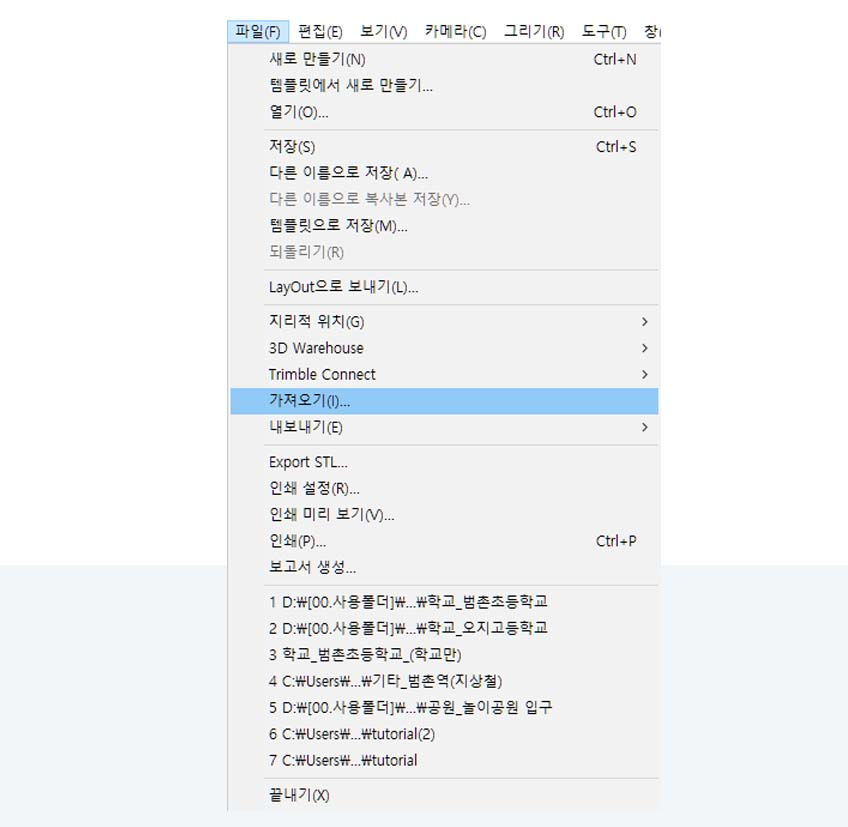
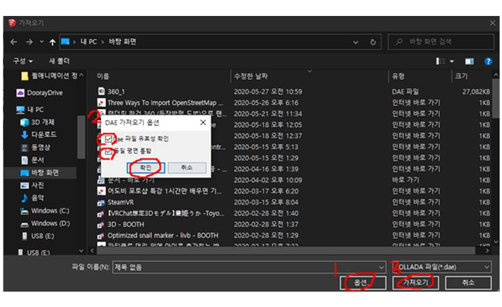

## 8.2.1. Blender에서 내보내기

1) Blender에서 File -> Export -> Collada(.dae) (.stl OR .3ds 등 사용불가)  

 

2) Export

## 8.2.2. SketchUp에서 가져오기

1) SketchUp에서 **File -> import**  

2) 옵션 > 파일유효성, 동일 평면 통합 체크 > 가져오기  

