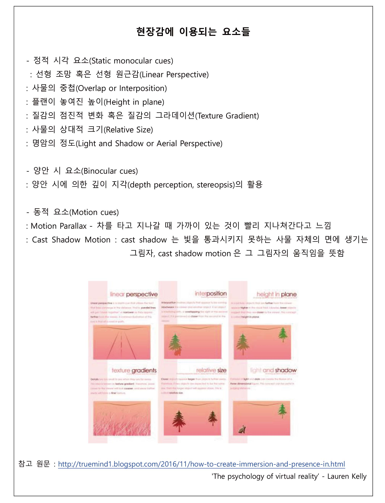
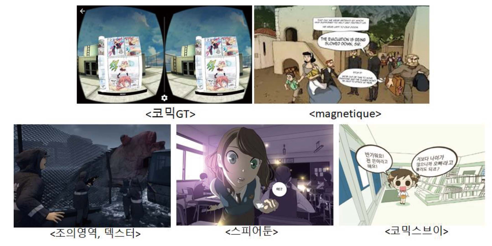

## 2.1. 가상현실 시장에 적합한 VR만화 장르

- **강력한 ip 파워와 압도적인 생산성을 가진 만화. 따라서 콘텐츠가 부족하고, 지속적인 사용자 유입에 어려움을 겪고 있는 VR 플랫폼에 적합한 콘텐츠이다.**

- 정지 이미지 연출 & 이야기 중심으로 저 사양의 독립 VR 기기에서도 가능한 낮은 성능으로 구동 가능합니다.  
- 1인 작가의 창작 시스템으로 제작비가 적게 듭니다.  
- 유명 만화가 & 캐릭터의 힘을 보유한 ip활용성이 좋습니다.  
- 남녀노소 불문한 다양한 장르로 구성되어 있습니다.  
- 시리즈 콘텐츠로 지속적인 사용자 유입과 높은 시간 점유율을 확보할 수 있습니다.  

- **네이버, 다음 웹툰의 초기 역할은 만화 자체로서의 유료 수익율보다는 네이버, 다음의 포털 재방문을 유도하는 역할로 존재하여 네이버, 다음 플랫폼 사용 또한 유도하였습니다.**

## 2.2. 다양한 VR웹툰의 형식

- **가상현실의 최고 가치는 더 높은 현장감(presence)입니다.**

“모든 매체는 ‘허구 세계에 빠져들기’(의심 정지) 라는 것이 필요합니다. 이야기 실제상황과 우리가 실제상황으로 인식하는데 간극이 있기 때문, 가상현실은 그 간극을 이어주는 기술입니다. ”   
<i> -크리스 밀크(Chris Milk) 가상현실이 최고의 공감 기계를 만드는 방법 中 - </i>

현장감을 높이기 위해서는 하나의 요소가 아닌 다양한 기술 요소가 결합되며, 이 중 정적 시각 요소와 양안 시 요소까지가 정지 이미지인 만화에서 활용 가능한 요소입니다.

보통 이야기의 몰입감을 높이기 위해 만화에서 사용하는 다양한 연출이 정적 시각 단서에 해당됩니다. 예를 들어 선형 조망 원근감과 같은 경우, 기본적으로 이미지로서 사용되던 현장감이었으며, 사물의 상대적 크기를 단순히 원근감을 나타내기 위함이 아니라 이야기 몰입감이나 동세를 극대화 하기 위해 컷이나 글자의 상대적 크기를 달리 하였습니다.

만화는 있는 그대로 전달하기 보다는 이야기가 내재한 감정을 전달하기 위해 실제를 왜곡하거나 과장하여 현장감을 높이는데 이 점이 다른 실감 VR콘텐츠와 큰 차별성이 될 수 있습니다.

(참고 원문 : http://truemind1.blogspot.com/2016/11/how-to-create-immersion-and-presence-in.html <i> 'The psychology of virtual reality’ - Lauren Kelly</i>)

 

*다양한 VR툰의 예시들

-활용 요소들 : 만화ip, 컷, 말풍선, 스테레오스코피, 2D혹은 셀풍의 이미지, 360도 만화 공간 등  

 

- 코믹 GT. Retrieved from http://www.khgames.co.kr/news/articleView.html?idxno=104872&replyAll=&reply_sc_order_by=I
- Magnetique. Retrieved from https://youtu.be/WC_I3aNnda4
- 조의 영역, 덱스터 : https://barunson.co.kr/img/download/2018BIFF_VRCinema.pdf (이미지)   http://www.dexterstudios.com/ko/portfolio/vr-the-tide/ (덱스터 스튜디오)
- 스피어툰 : http://www.inven.co.kr/webzine/news/?news=192547
- 코믹스브이 : https://comixv.com/

