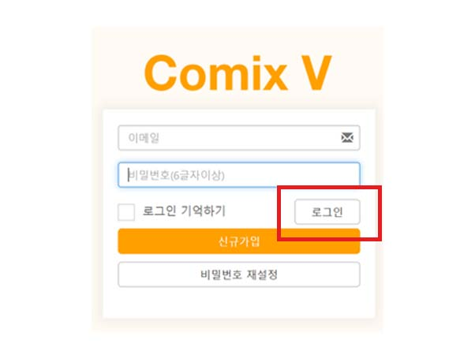
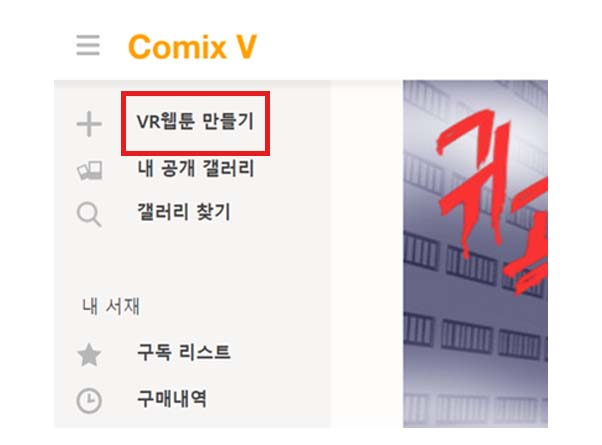
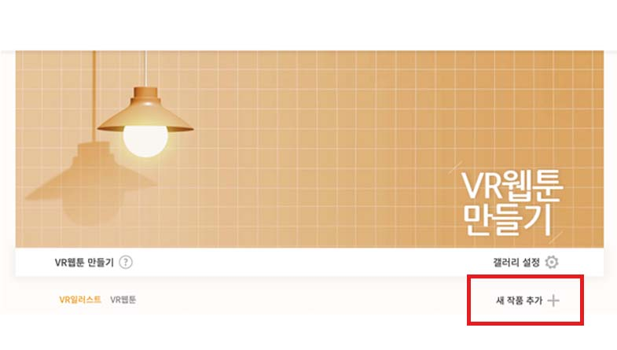
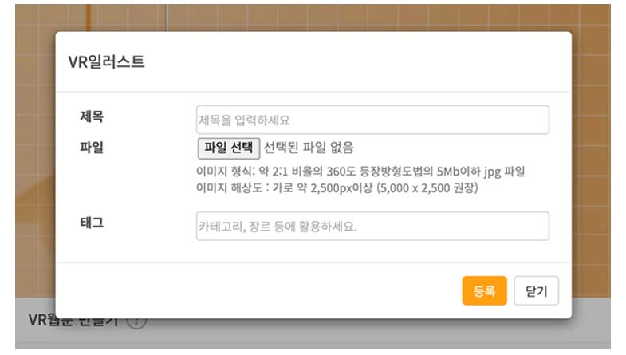
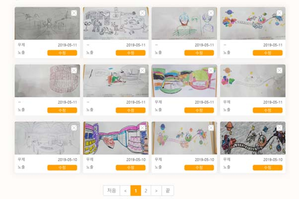
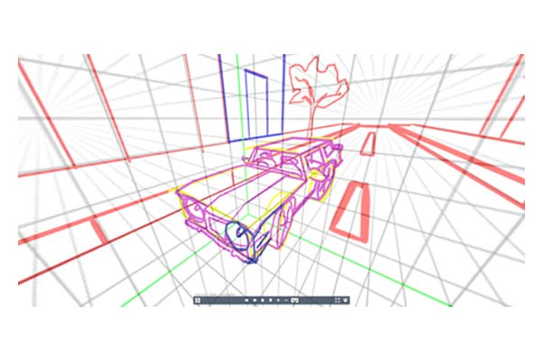
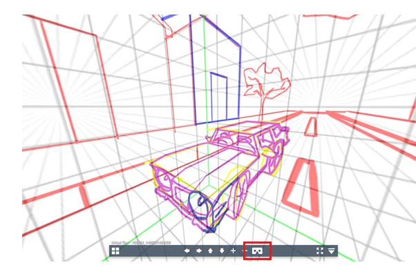
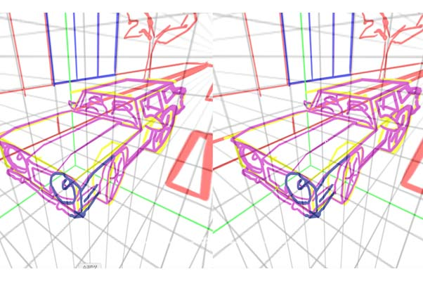

현재 코믹스브이 사이트에서 누구나 360 이미지 한 장 씩(VR일러스트) 업로드 해볼 수 있습니다.  
1) <https://www.comixv.com/register>로 들어가서 회원가입을 합니다.  

2) 로그인 후 메뉴의 “VR웹툰 만들기” 버튼을 클릭합니다.  

​3) VR일러스트 탭의 "새 작품 추가" 버튼을 클릭합니다.  

4) VR일러스트에 제목과 태그들을 추가하고 파일선택에서 제작한 파일을 선택하고 등록합니다.  

*등록 시 서버에 올라가고 360 뷰어 이미지가 생성되는 데는 시간이 조금 걸립니다. 이미지 파일 형식은 가로 세로 2:1 비율JPG로 4096 x 2048 을 권장합니다. 스마트폰으로 사진을 찍어 올릴 때는 jpg가 아닌 png파일 형식(아이폰의 경우)인 경우와 일부 포토앱에서 사진의 해상도가 떨어지는 문제를 주의하고 업로드 하시면 됩니다.

5) 갤러리에 등록이 되면 클릭해서 결과물을 확인합니다.  

6) 위와 같이 클릭해보면 360으로 변환된 이미지를 확인할 수 있습니다.  
<https://goo.gl/PFk0P3>

7) 아래의 카드보드 이미지를 누르면 두개의 이미지로 분할되어 간이 VR HMD인 카드보드로도 확인 가능하며, 코믹스브이의 최신 VR앱에서는 갤러리 번호를 입력하여 공개된 VR일러스트와 VR웹툰을 보실 수 있습니다.  

