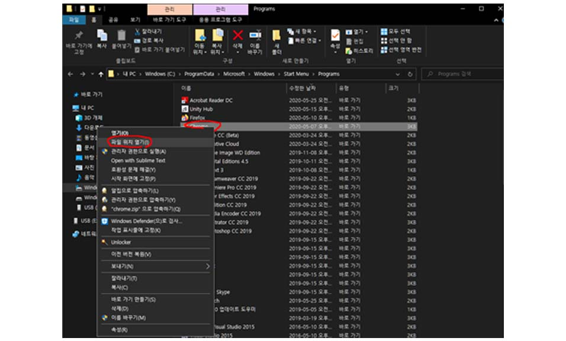

## 8.1.1. 환경설정

#### 1) RenderDoc 1.8를 설치합니다. <u>(1.8버전, 최신버전으로 설치하셔야 합니다.)</u>
<https://renderdoc.org/builds> OR 첨부파일을 참조합니다.

>> 1-1) Next를 클릭한다.  

  

>> 1-2) Typical 클릭    

>> 1-3) InstallW 클릭  

#### 2) Blender 2.8 설치  
<https://www.blender.org/download/Blender2.82/blender-2.82-windows64.msi/>

#### 3) 크롬 바로가기 파일 만들기 ###

>> 3-1) 윈도우 검색창에 Chrome 검색 후 ‘파일 위치 열기’를 클릭합니다.  

>> 3-2) Chrome 파일 선택 후 ‘파일 위치 열기’를 클릭합니다.

>> 3-3) Chrome 파일 선택 후 우클릭 ‘바로가기 만들기’를 클릭합니다.  

>> 3-4) 예(Y) 클릭  

>> 3-5) Chrome바로가기 파일 선택 후 우클릭 > 속성 > 대상에 **C:\Windows\System32\cmd.exe /c "SET RENDERDOC_HOOK_EGL=0 && START "" ^"C:\Program Files (x86)\Google\Chrome\Application\chrome.exe^" --disable-gpu-sandbox --gpu-startup-dialog"**  
위 링크를 복사 붙여넣기(Ctrl C+V) 합니다.

>> 3-6) 해당 모습으로 뜨면 완성입니다.

 
 
 

## 8.1.2. 구글 이미지 불러오기

#### 1) Blender Add-ons 설치(Maps Models Importer v0.2.2) 합니다.  

> 1-1) MapsModelsImporter-v0.2.2.zip 다운 OR 첨부파일을 참고합니다.  
<https://github.com/eliemichel/MapsModelsImporter/releases/tag/v0.2.2>

> 1-2) Edit -> Proferences  

> 1-3) Install   

> 1-4) MapsModelsImporter-v0.2.2.zip 설치합니다.  

> 1-5) Add-ons 검색창에 imp 입력 **import Export**를 체크합니다.

#### 2) 구글맵 변환(꼭 순서대로!, 실행 전 인터넷창을 전부 꺼주시면 좋습니다.)  
> 2-1) **RenderDoc** 실행합니다.

> 2-2) **Pid 넘버** 확인을 합니다.   
(임의로 랜덤 생성되므로 각자 다르니 바로 확인 누르시면 안됩니다.)  

> 2-3) RenderDoc -> Inject into Process

> 2-4) Refresh 입력창에 Pid 넘버입력후 Inject를 합니다.  

> 2-5) 크롬창에서 확인을 눌러줍니다.  
(아래 사진과 같이 위에 관리자모드, 이상한 숫자들 떠야 제대로 실행)  

 

> 2-6) 검색창에 구글맵검색 후 구글맵사이트로 갑니다.  

> 2-7) 구글맵 지역을 바꿔주기 위해 맨 우측 하단에  대한민국을 클릭합니다.

> 2-8) 지역설정에서 영국으로 한 다음, 하단에 저장을 클릭합니다.  

> 2-9) 구글맵 좌측 하단 위성을 클릭합니다.  

> 2-10) 구글맵 하단 우측 하단 지구본 아이콘을 클릭합니다.   
(클릭 후 지구본 위쪽에 나침반이 떠야합니다)

> 2-11) 구글맵 검색창에 원하는 장소를 입력합니다.  
(단, 한국 이외의 지역으로 해야합니다. 한국은 구글맵 제한 국가이기 때문입니다.)  

> 2-12) RenderDoc > 우측 Capture를 클릭 합니다. 

> 2-13) 크롬창 화면 좌측 클릭상태에서 좌우로 흔들흔들 움직여줍니다.  

> 2-14) RenderDoc에서 이미지 생성된 것 클릭 후, 좌측에 Colour Pass#3가 있는지 확인 합니다.  
(Colour Pass#3가 없을 시, 정상적인 이미지 파일이 아닙니다)

> 2-15) Blender -> File-> Import-> Google Maps Capture  

> 2-16) RenderDoc파일 import  

> 2-17) 끝  

